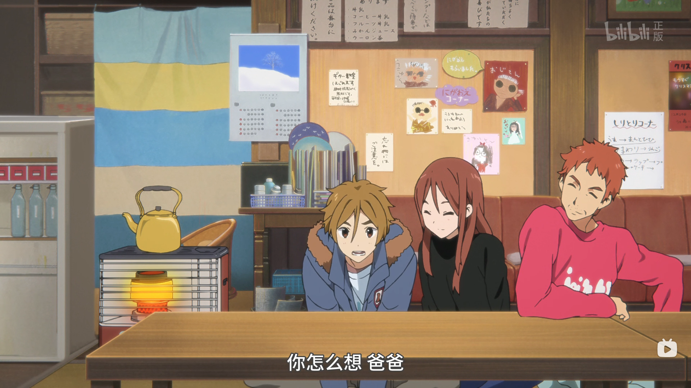
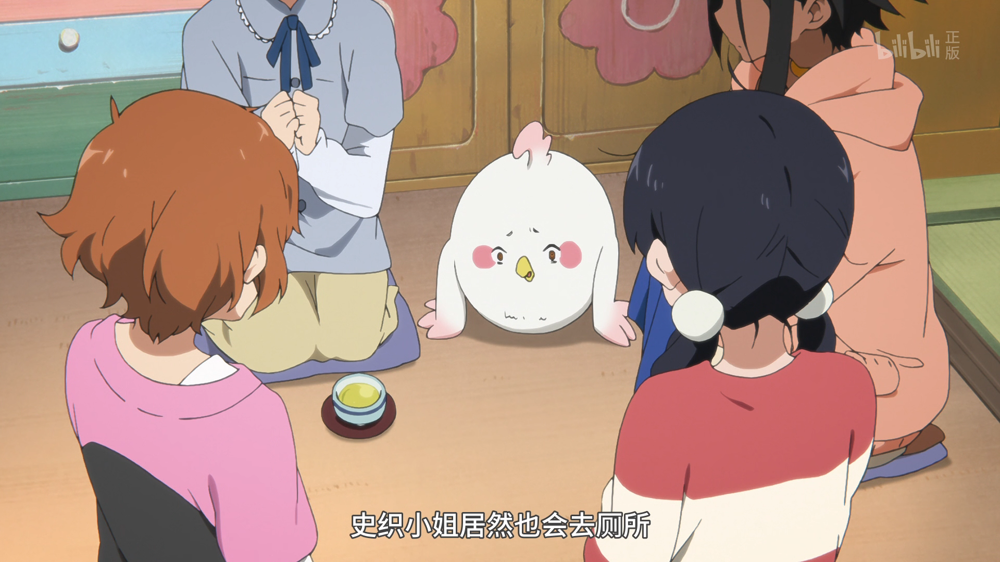
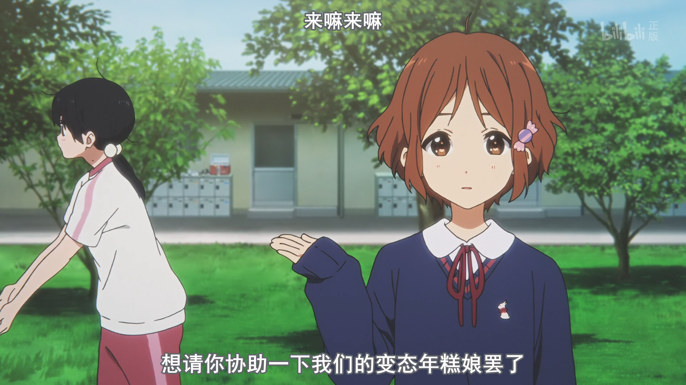
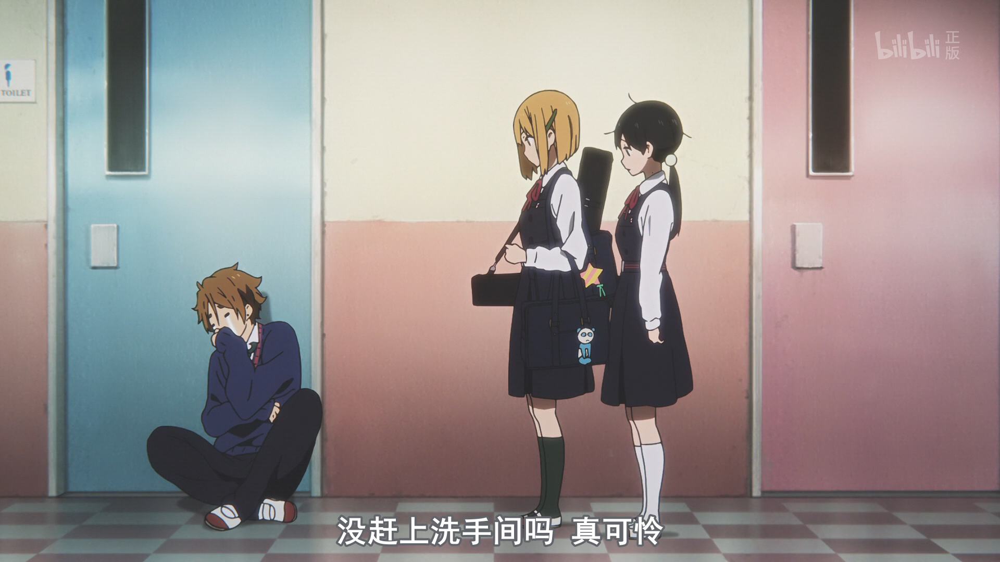
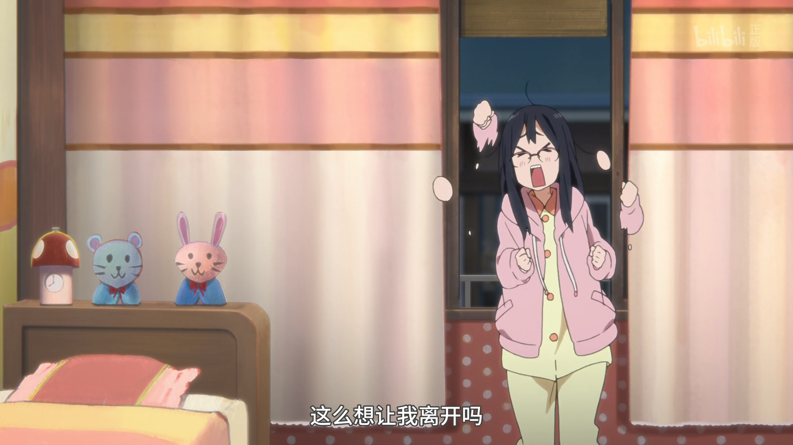
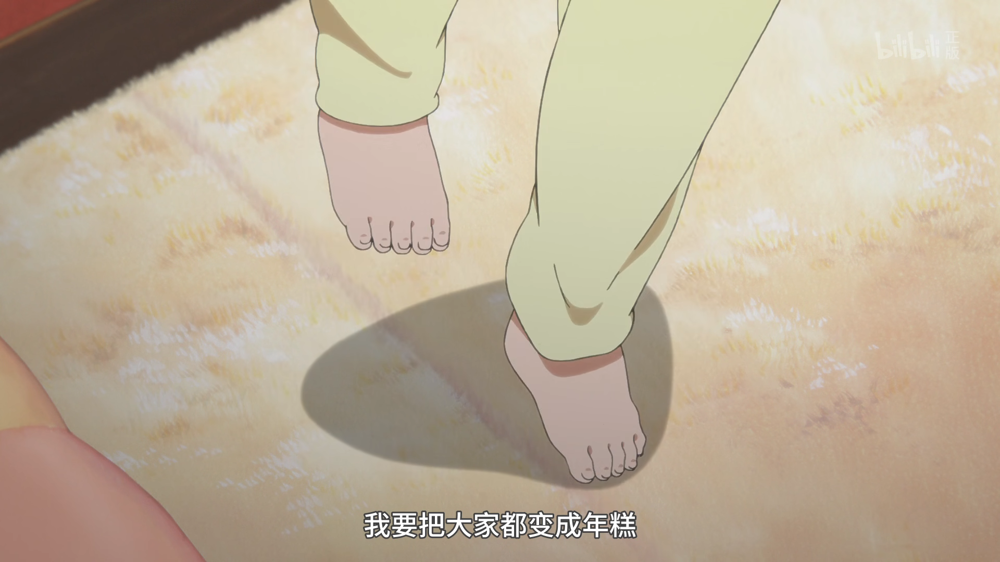
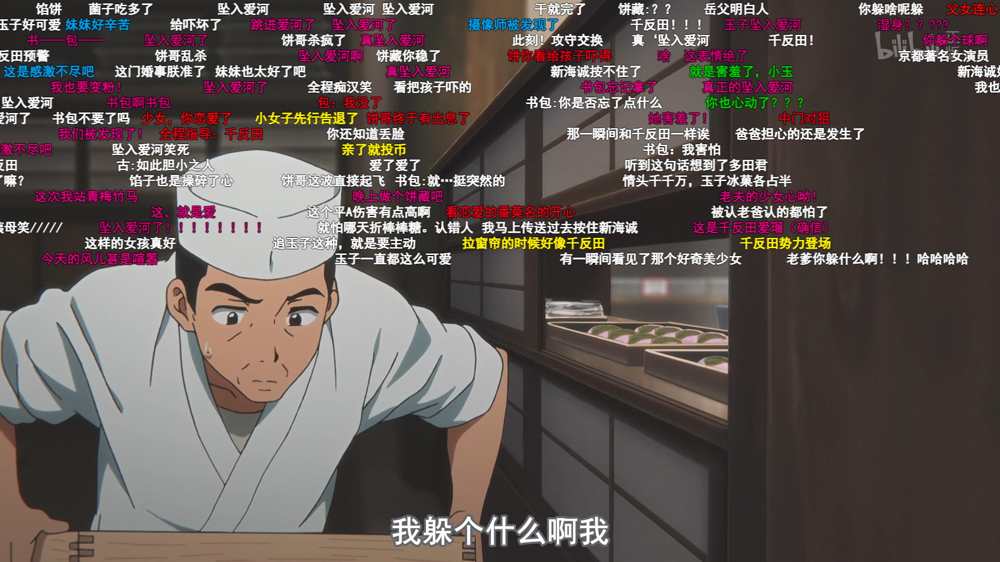

---
# 这是页面的图标
icon: bilibili

# 这是文章的标题
title: 玉子市场

index: 1

# 一个页面可以有多个分类
category: 

# 一个页面可以有多个标签
tag: 

# 你可以自定义页脚
# footer: 这是测试显示的页脚
---

## 经典语录

### 青年啊 你还真是好懂啊

### 趁乱认父

### 史织小姐居然也会去厕所

### 变态年糕娘

### 我的心也折断了...

## 可可爱爱

### 点赞三连

### 哭哭

### 生气气

## 人物集合

### 潦草的饼哥

### 可爱神奈

