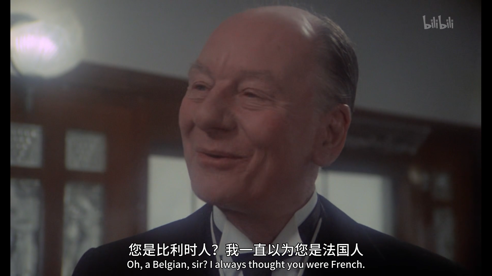
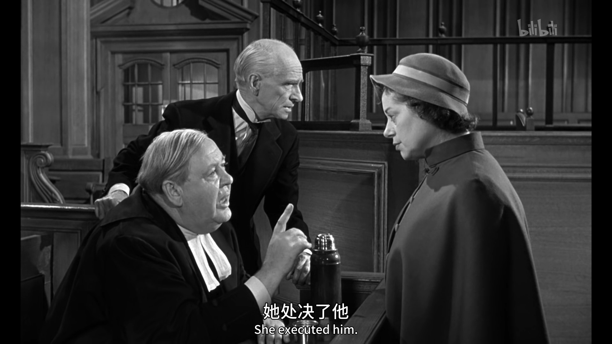
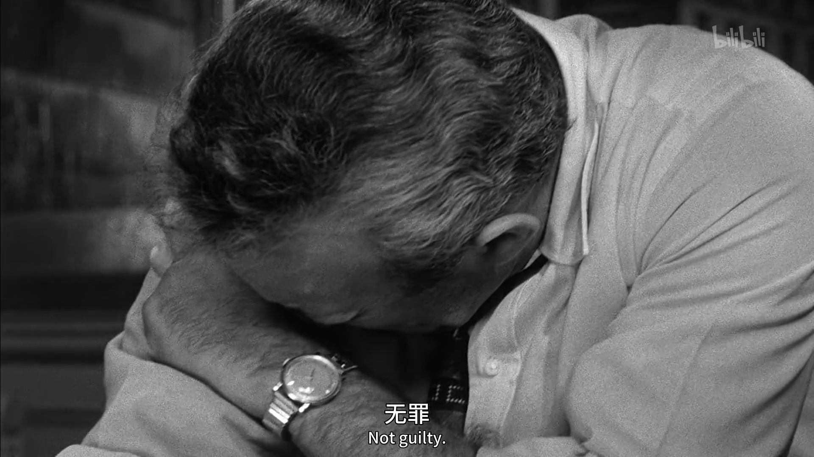
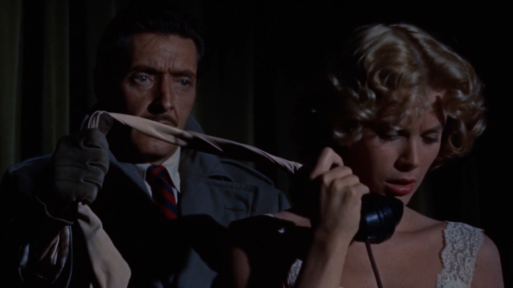
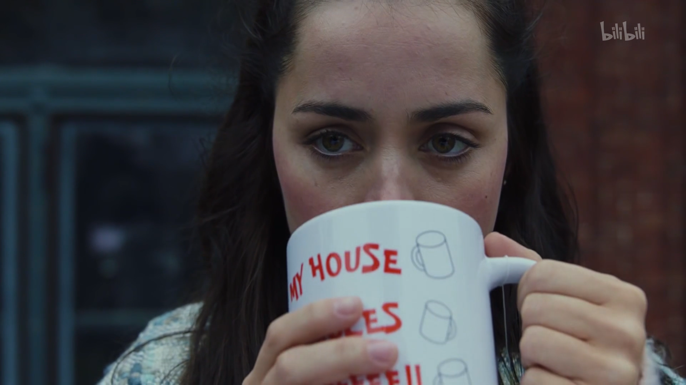
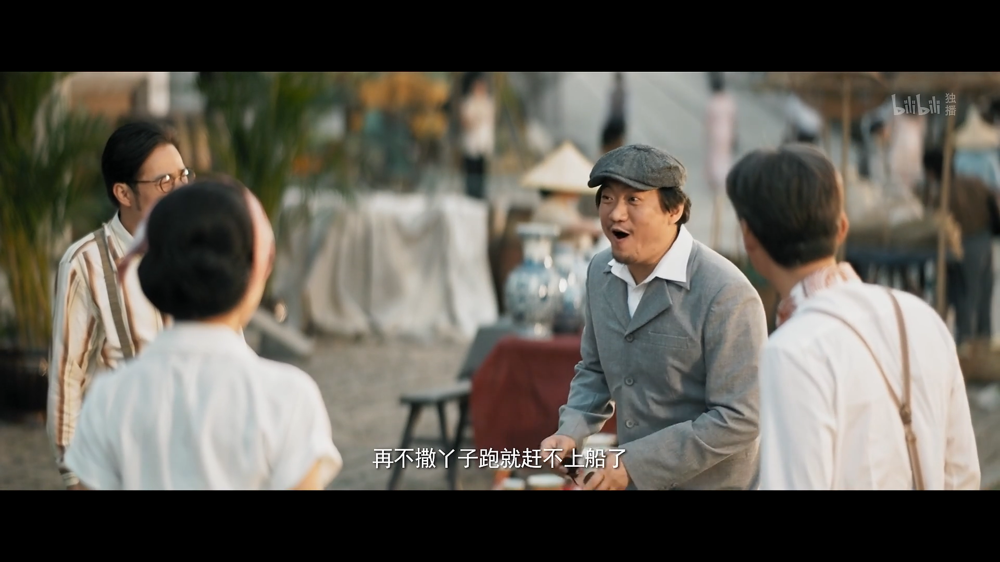
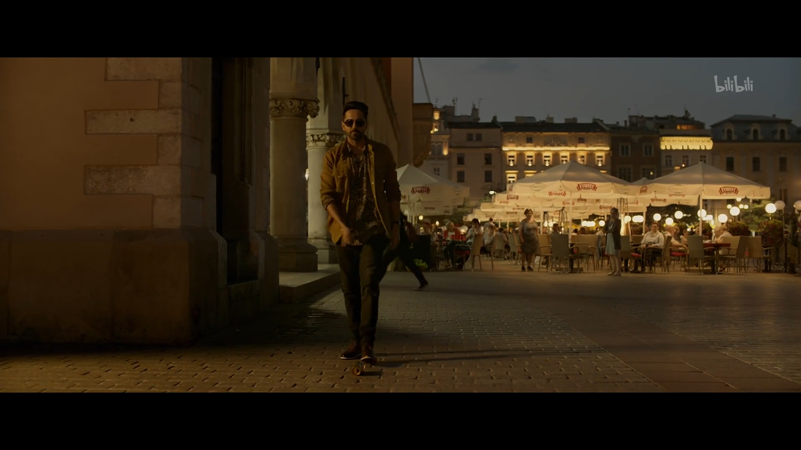
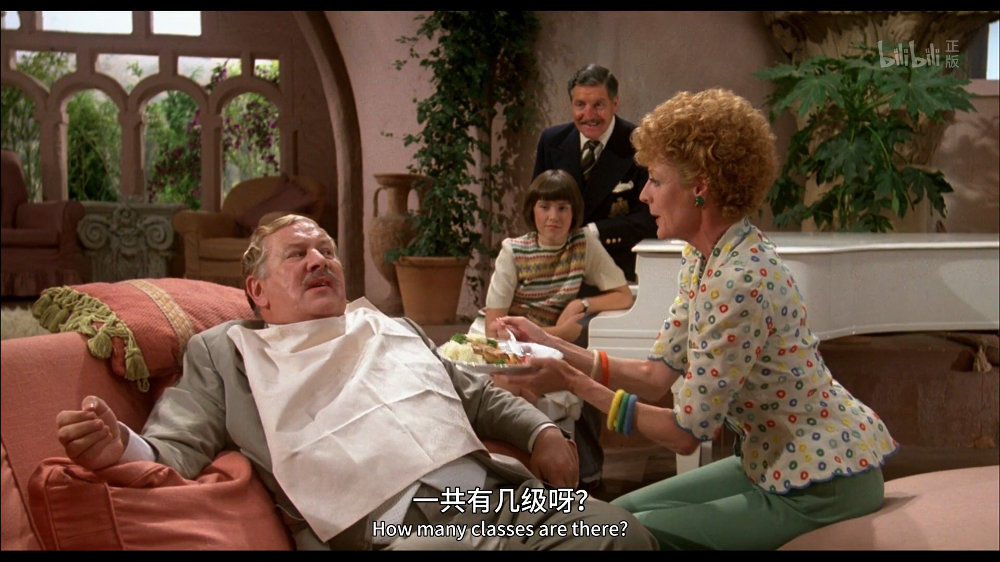
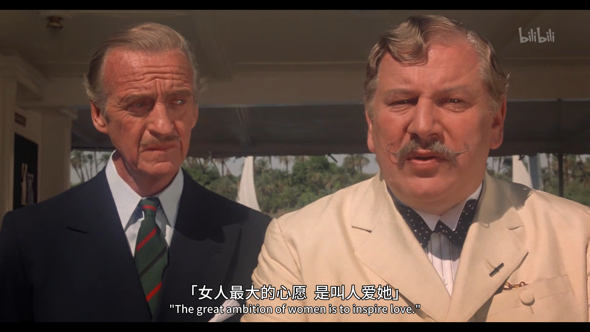

---
# 这是页面的图标
icon: note

# 这是文章的标题
title: 悬疑推理

# number | boolean
# 侧边栏按 indx 从小到大排序，false 则不出现在侧边栏
index: 1

# 写作日期
# date: 2022-01-01

# 一个页面可以有多个分类
category: 

# 一个页面可以有多个标签
tag: 

# 你可以自定义页脚
# footer: 这是测试显示的页脚
---

个人偏爱，虽然大部分的电影都看不到细节，只有到侦探揭晓答案的时候才能享受到一点乐趣。

## 东方快车谋杀案 :steam_locomotive: <Badge text="密室杀人" type="note"/> 

[东方快车谋杀案-电影-高清正版在线观看-bilibili-哔哩哔哩](https://www.bilibili.com/bangumi/play/ss37605)

> 经典的密室杀人，一个侦探和一个笨蛋搭档一起破案。

也许我们都会笑那个笨蛋搭档，见谁都觉得是凶手，拿一些奇怪的理由去怀疑别人。看到最后你就知道了，我们才是那个笨蛋。别的电影都是永远猜不到杀手是谁，这部电影是永远猜不完杀手还有谁。

以及，经典的乳法情节。

## 控方证人 <Badge text="意想不到的反转才是好反转" type="tip"/> 

[控方证人-电影-高清正版在线观看-bilibili-哔哩哔哩](https://www.bilibili.com/bangumi/play/ss34318)

> 黑白电影很有质感，我喜欢结局的反转。

对于现在粗制滥造的电影和剧情，用脚趾头都能猜到下一步会发生什么，会在什么节点曲折，一部电影总要弄得一波三折但是又非常套路是现在电影的缺陷。这部电影的结局，会让你觉得，到这里应该就结束了，但是它就是反转了，而且你根本不会设想还有这种走向。

## 十二怒汉 :rage:

[十二怒汉-电影-高清正版在线观看-bilibili-哔哩哔哩](https://www.bilibili.com/bangumi/play/ss34055/)

> 没想到黑白的经典电影比现在好看的电影要多的多啊

陪审团的十二个人在一个房间里讨论一个男孩的审判结果，从一票无罪坚持到最后的全票无罪，难能可贵的是男人能够坚持自己的疑问和对一条生命的足够尊重。

与其说是十二怒汉，其实只有一个怒汉，从头到尾都在无能狂怒。

## 电话谋杀案 :joy_cat:

[电话谋杀案-电影-高清在线观看-bilibili-哔哩哔哩](https://www.bilibili.com/bangumi/play/ss29002/)

> 点开以前没想到会这么搞笑

披着悬疑的外套演着喜剧电影，这是我见过心思缜密但是行凶过程步步出错的倒霉杀手。

##  利刃出鞘 :moneybag:

[利刃出鞘-电影-高清正版在线观看-bilibili-哔哩哔哩](https://www.bilibili.com/bangumi/play/ss32628/)

> 没有利益冲突的时候，所有人都把你看作家人。当你侵犯到他们的利益了，你就变成了敌人。

拍的好的喜剧加悬疑的电影真的非常有意思，剧中众人对女主态度的前后对比也是真的讽刺。当然最好玩的还是，当女主继承了遗产以后，众人离开了自己原来的家，女主直接入住。看图👇

## 扬名立万 <Badge text="喜剧电影" type="tip"/> 

[扬名立万-电影-高清独家在线观看-bilibili-哔哩哔哩](https://www.bilibili.com/bangumi/play/ss39892/)

> 国产电影中，除了《让子弹飞》为数不多让我觉得精彩的电影了。

很精彩，也很好笑，还有很多的讽刺，但是这里就不列举了，~~因为有些讽刺我确实没看懂~~。虽然虽然最后推理部分以及整个案件的设计，有点拉跨，完全比不过经典的推理电影；但是主要还是精彩在前半部分众人的交谈，看就对了。

还有，陆子野这个角色是真的好玩。

## 后窗 :heart_eyes: <Badge text="美女贴贴" type="danger"/> <Badge text="喜剧电影" type="tip"/>  

[后窗-电影-高清在线观看-bilibili-哔哩哔哩](https://www.bilibili.com/bangumi/play/ss28987)

> 说真的，应该把惊悚的标签换成喜剧

整个视角就很有意思，男主打着石膏坐在房间里看着窗外，也正是从窗户目睹了凶手的一系列诡异操作。因为只有男主的视角，只有主观的臆测，所有自以为看到的一切线索更像是故意露出的马脚，所以有一段时间我甚至觉得这是一个乌龙故事。虽然他的警察朋友不太相信他，但是男主还是凭借敏锐的洞察力捕捉到了很多有用的细节。

必须强调，女主真的好漂亮。

## 调音师 

[调音师-电影-高清正版在线观看-bilibili-哔哩哔哩](https://www.bilibili.com/bangumi/play/ss33571/)

> 反转，反转，还在反转。黑吃黑，黑吃黑，还是黑吃黑。

怎么样一个倒霉蛋，能接二连三地目睹凶杀现场，最后引火上身，开启自己的逃亡之旅。这应该是我见过反转最多的电影了，你永远不知道谁能笑到最后。可能因为过于惊悚还是别的什么原因，我认为这是一部不错的电影，但就是没那么喜欢。

## 阳光下的罪恶 

[阳光下的罪恶-电影-高清正版在线观看-bilibili-哔哩哔哩](https://www.bilibili.com/bangumi/play/ss38915/)

> 可爱的胖菠萝系列，你永远可以相信阿婆。

越是没有不在场证明的，可能越是无辜。反倒无时不刻都在表演，可以营造人设的，越是凶手。

## 尼罗河上的惨案 

[尼罗河上的惨案-电影-高清正版在线观看-bilibili-哔哩哔哩](https://www.bilibili.com/bangumi/play/ss38028)

> 又是夫妻作案捏，过多的财富只会让自己变得更不安全。

阿婆的推理还是不错的，只是剧情上来说，可能还不够吸引我，或者少了点独有的特色。片尾还有诈胡环节。

