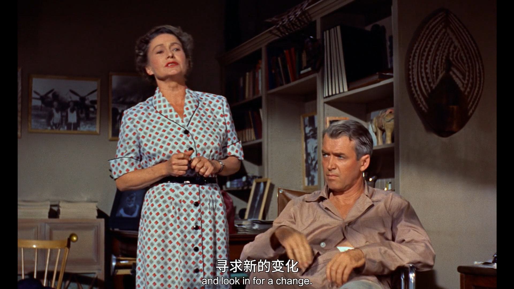
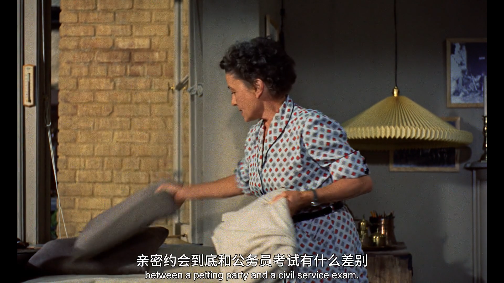
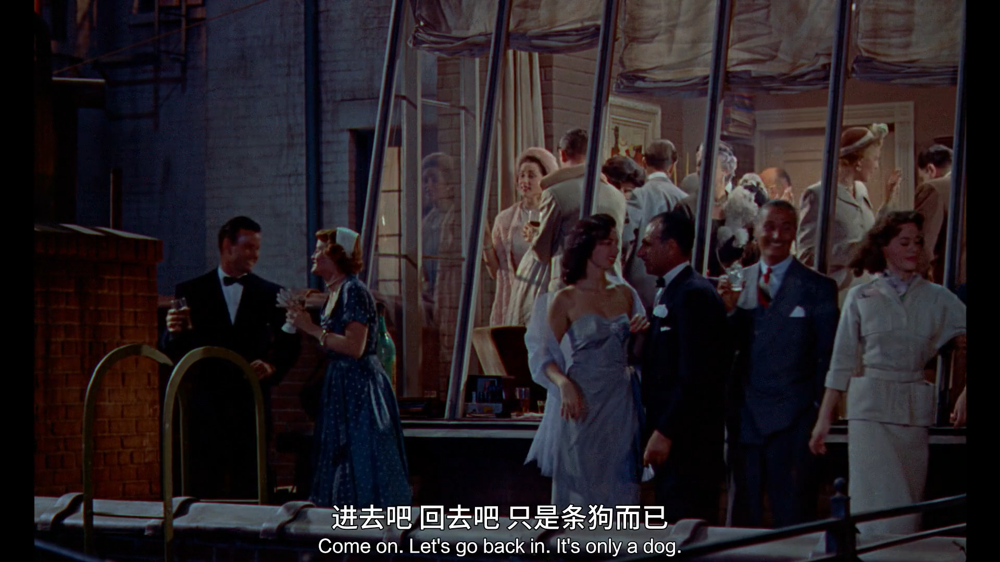
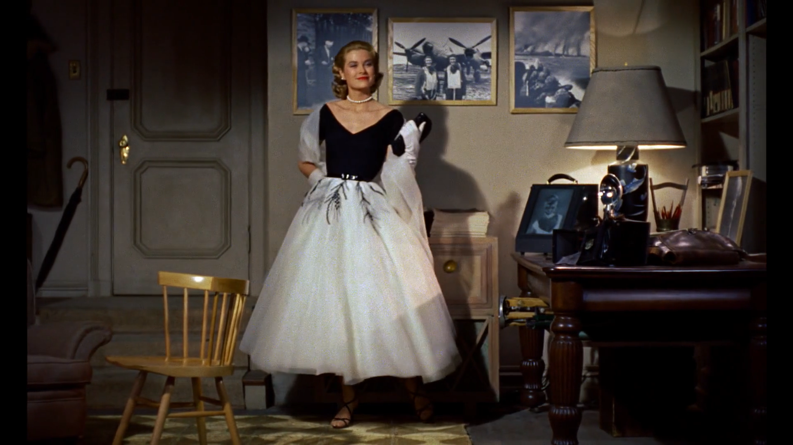
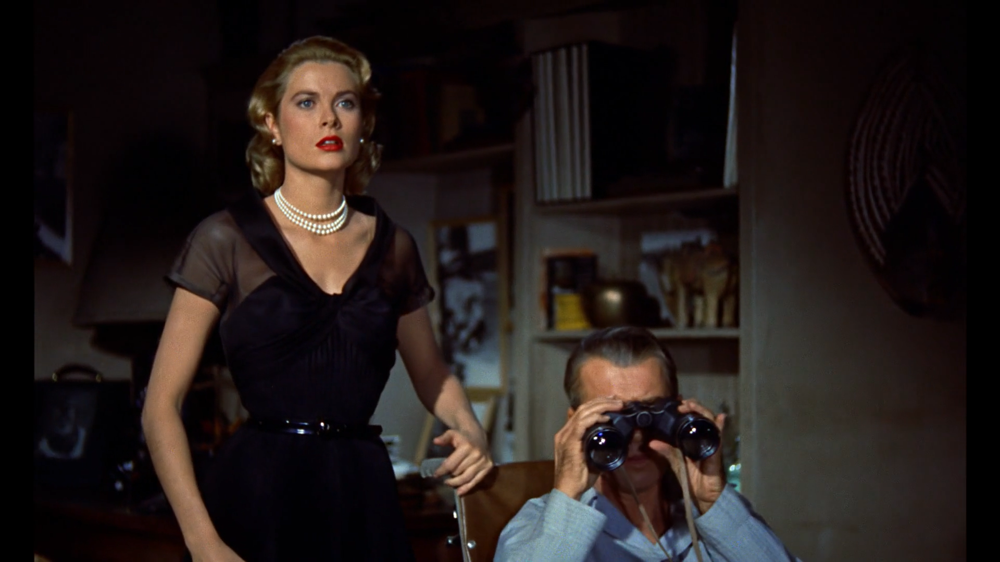
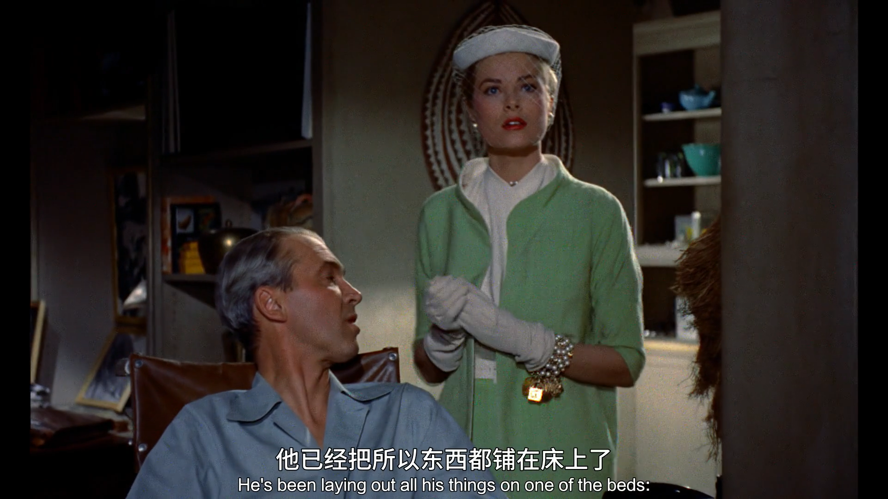
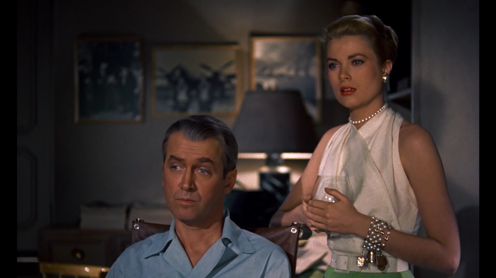
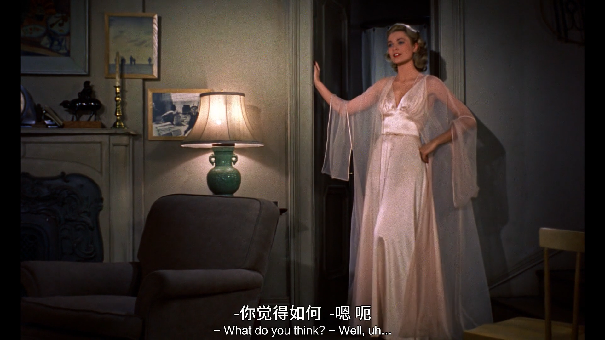
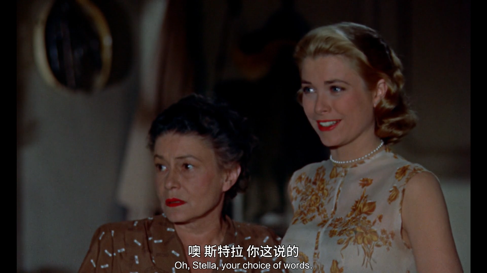
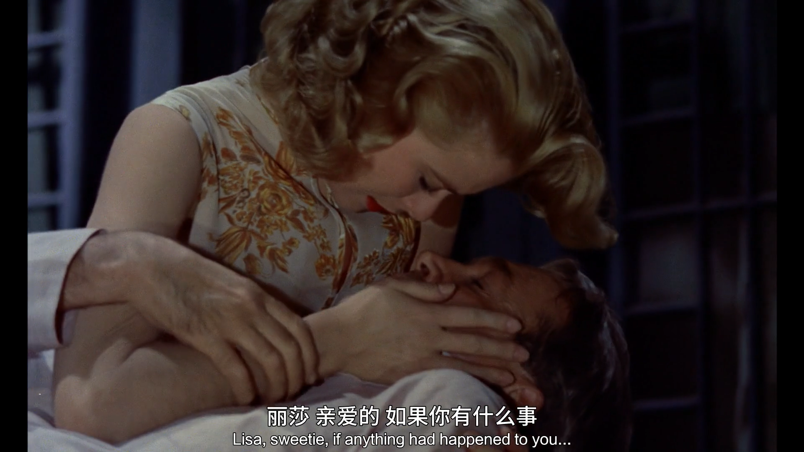

---
# 这是页面的图标
icon: page

# 这是文章的标题
title: Rear Window（后窗）

# number | boolean
# 侧边栏按 indx 从小到大排序，false 则不出现在侧边栏
# index: 4

# 写作日期
date: 2022-05-08

# 一个页面可以有多个分类
category: 

# 一个页面可以有多个标签
tag: 

# 你可以自定义页脚
# footer: 这是测试显示的页脚
---

## 人们应该从自己屋子里出去，寻求新的变化

> What people ought to do is get outside their own house and look in for a change.

## 以前的人只要见面了，心动了，就结婚。现在呢，人们读一大堆书，用复杂的专业术语分析对方，直到你们不能说出亲密约会到底和公务员考试有什么差别

> Once it was see somebody, get excited, get married. Now, it's read a lot of books, fence with a lot of four-syllable words, psychoanalyze each other... util you can't tell the difference... between a petting party and a civil service exam.

## 回去吧，只是条狗而已

> Let's go back in. It's only a dog.

## 美女 😍

