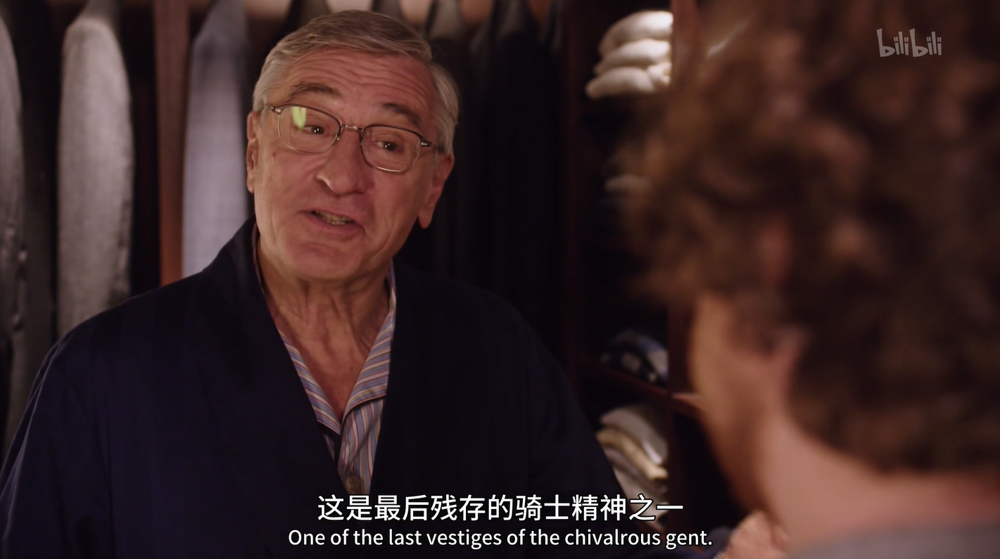

---
# 这是页面的图标
icon: page

# 这是文章的标题
title: The Intern (实习生) 

index: 1

date: 2022-05-06

# 一个页面可以有多个分类
category:

# 一个页面可以有多个标签
tag:

# 你可以自定义页脚
# footer: 这是测试显示的页脚
---

[实习生-电影-高清正版在线观看-bilibili-哔哩哔哩](https://www.bilibili.com/bangumi/play/ss32988)

## 音乐家从不退休，江郎才尽方休止。我心中还有音乐，这点毋庸置疑。

> Musicians never retire. They stop when there’s no more music in them. Well, I still have music in me, absolutely positive about that.

 

## 循规蹈矩不是我们的训言

> Business as usual is not really our motto.

## 你当时绝对是喜欢这个主意的，所以我付诸实践了

> You definitely seemed to be liking the idea, so I set it in motion.

## 做正确的事情永远不会错

> You’re never wrong to do the right thing. 

## 佳人有泪，我们把手帕递给她们，这是绅士风度最后的遗存之一

> It’s essential. That your generation doesn’t know that is criminal. The best reason to carry a handkrchief is to lend it. Women cry, we carry it for them. One of the last vestiges of the chivalrous.

