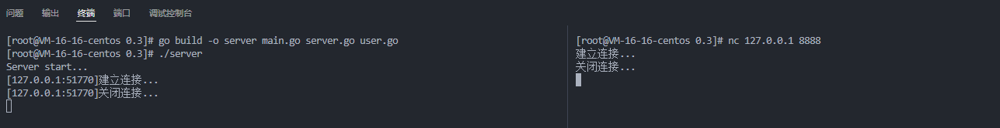
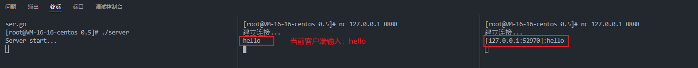

---
# 这是页面的图标
icon: golang

# 这是文章的标题
title: 创建用户

# number | boolean
# 侧边栏按 indx 从小到大排序，false 则不出现在侧边栏
index: 2

# 写作日期
# date: 2022-01-01

# 一个页面可以有多个分类
category: 

# 一个页面可以有多个标签
tag: 

# 你可以自定义页脚
# footer: 这是测试显示的页脚
---


## 用户

我们把每一个客户端都当作是一个用户，每个用户应当拥有自己的信息、并且能够请求一定的功能。


### 用户类

单独创建一个 `user.go` ，我们在此处定义用户类。

- Name，后期有一个修改用户名的功能，因此此处提供一个字段保存用户名信息
- conn，最重要的字段，标识每一个连接请求
- message，用于和 server 进行通信

```go
package main

import "net"

type User struct {
	Name string
	conn net.Conn

	// 消息接收
	message chan string
}

func NewUser(conn net.Conn) *User {
	addr := conn.RemoteAddr().String()

	user := &User{
		Name:    addr,
		conn:    conn,
		message: make(chan string),
	}

	return user
}
```


### server 中为每一次请求都创建相关的用户

（修改 `server.go/Handler()` 函数）

```go
func (this *Server) Handler(conn net.Conn) {
	user := NewUser(conn)

	// 在开启 server 的终端中打印信息
	fmt.Println("[" + user.Name + "]建立连接...")
	defer fmt.Println("[" + user.Name + "]关闭连接...")

	// 当前连接的终端打印信息
	conn.Write([]byte("建立连接...\n"))
	defer conn.Close()
	defer conn.Write([]byte("关闭连接...\n"))
}
```


### 测试结果

 


## 广播消息

完成连接及用户的创建之后，我们尝试着将客户端的输入，打印到 server  或者其他客户端处


### 维护在线用户列表

（补充 `server.go/Server` 类）想要实现广播功能，先要有一个列表维护所有的在线用户，为此我们在 server 类中补充一些字段

```go
type Server struct {
	Ip   string
	Port int

	// 在线用户列表
	UserMap map[string]*User
	mapLock sync.RWMutex

	// 广播消息
	Message chan string
}

func newServer(ip string, port int) *Server {
	server := &Server{
		Ip:      ip,
		Port:    port,
		UserMap: make(map[string]*User),
		Message: make(chan string),
	}

	return server
}
```


（修改 `server.go/Handler()` 函数）当一个客户端连接之后，我们需要将该用户信息加入 UserMap 当中

```go
func (this *Server) Handler(conn net.Conn) {
	user := NewUser(conn)

	// 当前连接的终端打印信息
	conn.Write([]byte("建立连接...\n"))

	// 上线加入 UserMap
	this.mapLock.Lock()
	this.UserMap[user.Addr] = user
	this.mapLock.Unlock()
}
```


### 对客户端的输入进行广播


**服务端广播消息**

（添加 `server.go/BroadCast()` 函数）为客户端提供的广播消息方法，会将该用户的消息广播给其他所有的在线用户

```go
// BroadCast
// - server 对所有用户进行广播消息
// - user 是发送消息的用户，可以为 nil
func (this *Server) BroadCast(user *User, msg string) {
	sendMsg := "[" + user.Name + "]" + ":" + msg

	this.mapLock.Lock()
	for _, toUser := range this.UserMap {
		if user != toUser {
			toUser.Message <- sendMsg
		}
	}
	this.mapLock.Unlock()
}
```


**监听客户端输入**

- （添加 `user.go/ListenWrite()` 函数）监听客户端的输入并调用 server 的广播函数，尝试发送给其他客户端

```go
// ListenWrite 监听用户输入
func (this *User) ListenWrite(server *Server) {
	buf := make([]byte, 4096)

	for {
		n, err := this.conn.Read(buf)

		// 用户下线，不再发送消息
		if n == 0 {
			return
		}

		if err != nil && err != io.EOF {
			fmt.Println("Conn Read err:", err)
			return
		}

		// 获取用户输入（去掉'\n'）
		msg := string(buf[:n-1])
		server.BroadCast(this, msg)
	}
}
```

- （修改 `server.go/Handler()` 函数）为每一个客户端的连接单独开启一个协程去监听客户端的输入

```go
// Handler 处理每一个连接请求
func (this *Server) Handler(conn net.Conn) {
	..

	// server 监听该用户的输入
	go user.ListenWrite(this)
}
```


**客户端监听 server 的广播**

- （添加 `user.go/ListenMessage()` 函数）server 的广播是将信息写入每个用户的 Message 当中

```go
// ListenMessage 接收 server 发来的消息
func (this *User) ListenMessage() {
	for {
		msg := <-this.Message
		this.PrintMessage(msg)
	}
}
```

- （补充 `user.go/NewUser()` 函数）在创建用户时开启一个协程去监听 Message 的变化

```go
func NewUser(conn net.Conn) *User {
	...

	go user.ListenMessage()

	return user
}
```

- （添加 `user.go/PrintMessage()` 函数）当前客户端打印小心的方法

```go
// PrintMessage 终端打印消息
func (this *User) PrintMessage(msg string) {
	conn := this.conn
	conn.Write([]byte(msg + "\n"))
}
```


### 执行测试


