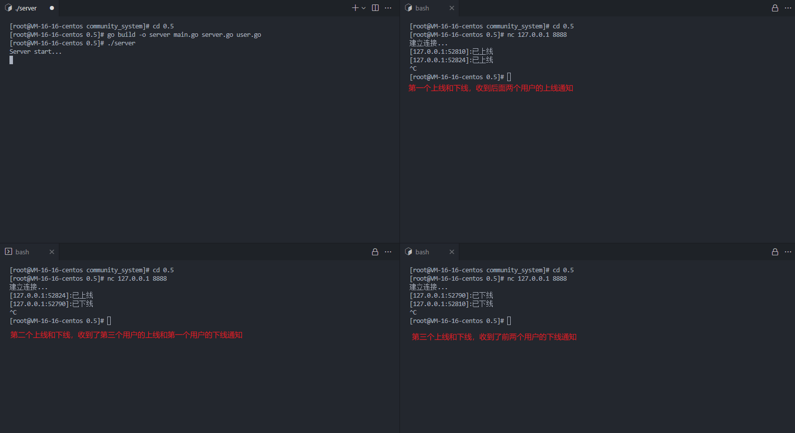

---
# 这是页面的图标
icon: golang

# 这是文章的标题
title: 上下线通知

# number | boolean
# 侧边栏按 indx 从小到大排序，false 则不出现在侧边栏
index: 3

# 写作日期
# date: 2022-01-01

# 一个页面可以有多个分类
category: 

# 一个页面可以有多个标签
tag: 

# 你可以自定义页脚
# footer: 这是测试显示的页脚
---


## 上下线通知


（添加 `user.go/` 函数）两个方法中分别需要往 UserMap 中添加和删除用户，毕竟 Map 需要维护的是在线用户的列表。

```go
// Online 用户上线
// - 用户加入 server.UserMap
// - 对所有用户进行广播提示
func (this *User) Online(server *Server) {
	server.mapLock.Lock()
	server.UserMap[this.Addr] = this
	server.mapLock.Unlock()

	server.BroadCast(this, "已上线")
}

// Offline 用户下线
// - 用户移出 server.UserMap
// - 对所有用户进行广播提示
func (this *User) Offline(server *Server) {
	server.mapLock.Lock()
	delete(server.UserMap, this.Addr)
	server.mapLock.Unlock()

	server.BroadCast(this, "已下线")
}
```


### 触发上线通知

（补充 `server.go/Handler()` 函数）在每个连接请求接入的时候，由 server 去触发用户的上线通知

```go
// Handler 处理每一个连接请求
func (this *Server) Handler(conn net.Conn) {
	user := NewUser(conn)

	// 当前连接的终端打印信息
	conn.Write([]byte("建立连接...\n"))

	// 上线加入 UserMap
	user.Online(this)

	// server 监听该用户的输入
	go user.ListenWrite(this)
}
```


### 触发下线通知

（补充 `user.go/ListenWrite()` 函数）在监听用户输入的协程当中，当输入字符数为零时，表示用户不再输入、也就意味着用户的下线，在此处去触发下线通知

```go
// ListenWrite 监听用户输入
func (this *User) ListenWrite(server *Server) {
	buf := make([]byte, 4096)

	for {
		n, err := this.conn.Read(buf)

		// 用户下线，不再发送消息
		if n == 0 {
			this.Offline(server)
			return
		}

		...
	}
}
```


## 执行测试


