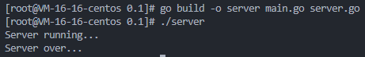
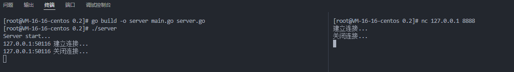

---
# 这是页面的图标
icon: golang

# 这是文章的标题
title: 启动服务

# number | boolean
# 侧边栏按 indx 从小到大排序，false 则不出现在侧边栏
index: 1

# 写作日期
# date: 2022-01-01

# 一个页面可以有多个分类
category: 

# 一个页面可以有多个标签
tag: 

# 你可以自定义页脚
# footer: 这是测试显示的页脚
---


## 服务


### 最基础的服务类

（创建 `server.go`）抛开所有功能不谈，我们先创建一个服务类，之后的功能我们再尝试着追加到这个类上。他现在可以不做任何事情，但是我们需要有他的存在。 ``

```go
package main

import "fmt"

type Server struct {
} 

func (this *Server) start() {
	fmt.Println("Server running...")

	defer fmt.Println("Server over...")
}
```


### 启动服务

（创建 `main.go`）我们需要一个 `main()` 函数来启动或者开始一个服务

```go
package main

func main() {
    server := &Server{}
	server.start()
}
```


### 执行

编译运行：

```sh
go build -o server main.go server.go
./server
```


:::center



:::


## 端口监听

聊天室肯定不能是一个人自娱自乐，需要多个客户端之间的通信，**现在我们在 `server.go` 上追加一些代码，让他能够监听端口，去和多个请求建立连接。**


### 补充字段

既然要监听端口，那就提供两个字段来保存相关的信息，并创建一个构造函数（纯个人习惯）

```go
type Server struct {
	Ip   string
	Port int
}

func newServer(ip string, port int) *Server {
	server := &Server{
		Ip:   ip,
		Port: port,
	}

	return server
}
```


### 开启监听

通过一个死循环不断去接收连接请求，并且单独开启一个协程去处理这个连接。

```go {25,32}
func (this *Server) Handler(conn net.Conn) {
    // 在开启 server 的终端中打印信息
	fmt.Println(conn.RemoteAddr().String(), "建立连接...")
	defer fmt.Println(conn.RemoteAddr().String(), "关闭连接...")

	// 当前连接的终端打印信息
	conn.Write([]byte("建立连接...\n"))
	defer conn.Close()
	defer conn.Write([]byte("关闭连接...\n"))
}

func (this *Server) start() {
	fmt.Println("Server start...")
	defer fmt.Println("Server over...")

	listener, err := net.Listen("tcp", fmt.Sprintf("%s:%d", this.Ip, this.Port))
	defer listener.Close()

	if err != nil {
		fmt.Println("net.listener err:", err)
		return
	}

	for {
		conn, err := listener.Accept()

		if err != nil {
			fmt.Println("listener accept err:", err)
			return
		}

		go this.Handler(conn)
	}
}
```


### 测试

- 终端中重新编译并执行

```sh
go build -o server main.go server.go 
./server 
```

- 开启新的终端进行测试

```sh
nc 127.0.0.1 8888
```


:::center



:::
