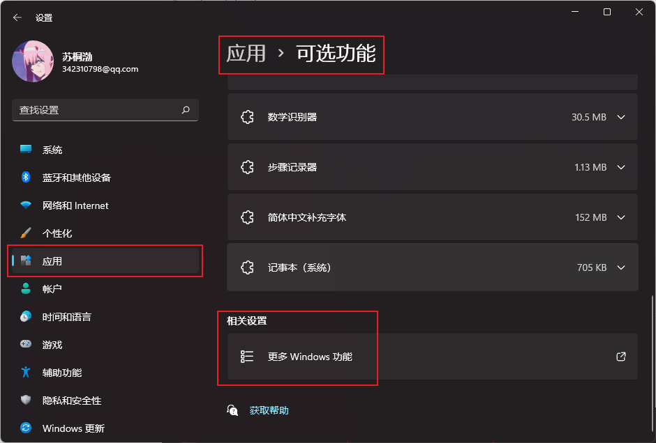
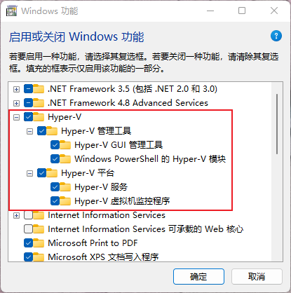

---
# 这是页面的图标
icon: docker

# 这是文章的标题
title: Win11 安装 Docker

# number | boolean
# 侧边栏按 indx 从小到大排序，false 则不出现在侧边栏
index: true

# 写作日期
# date: 2022-01-01

# 一个页面可以有多个分类
category: 

# 一个页面可以有多个标签
tag: 

# 你可以自定义页脚
# footer: 这是测试显示的页脚

---


## 开始 Hype-v 的虚拟化功能

**打开设置-应用-可选功能-更多 Windows 功能**


:::center





:::


### 添加 Hpye-v


::: danger 找不到 Hype-v

开启确实是在这里开启的，找不到确实是找不到。

:::


电脑上随便哪个位置新建一个 `.bat` 文件，（你可以新建一个 txt 文件，将内容复制进去再将文件改为 .bat）

```sh
pushd "%~dp0"
dir /b %SystemRoot%\servicing\Packages\*Hyper-V*.mum >hyper-v.txt
for /f %%i in ('findstr /i . hyper-v.txt 2^>nul') do dism /online /norestart /add-package:"%SystemRoot%\servicing\Packages\%%i"
del hyper-v.txt
Dism /online /enable-feature /featurename:Microsoft-Hyper-V-All /LimitAccess /ALL
```

以管理员身份运行该文件，等待安装最后输入 Y

----


打开 power shell 输入以下命令：

该命令是启动WSL。WSL 是 Linux 操作系统内核的一些组件，其实我们虽然是在 windows下进行安装 docker 实际上我们的 docker 还是跑在了 Linux 上的，这就是为什么我们需要用 WSL 的原因。

```sh
dism.exe /online /enable-feature /featurename:Microsoft-Windows-Subsystem-Linux /all /norestart

dism.exe /online /enable-feature /featurename:VirtualMachinePlatform /all /norestart
```


## 安装 WSL2

[WSL2 下载地址](https://wslstorestorage.blob.core.windows.net/wslblob/wsl_update_x64.msi)

**安装完成之后，命令行输入以下将 wsl2 设置为默认版本。**


```sh
wsl --set-default-version 2
```


## 安装 Docker

[Docker 下载地址](https://docs.docker.com/desktop/windows/install/)


## 参考

[windows11如何安装docker desktop_如梦@_@的博客-CSDN博客_win11安装docker](https://blog.csdn.net/weixin_43726471/article/details/122267300)
