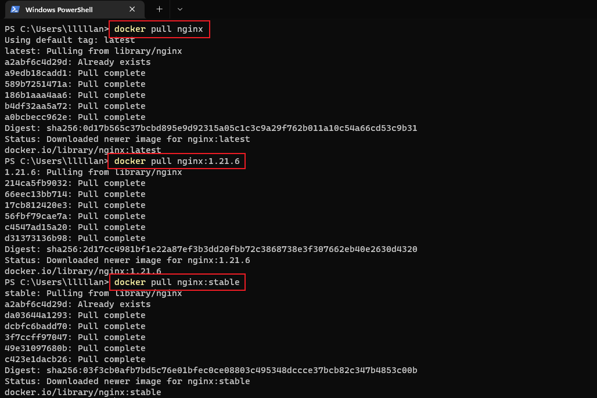
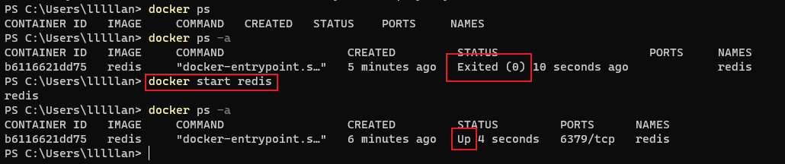
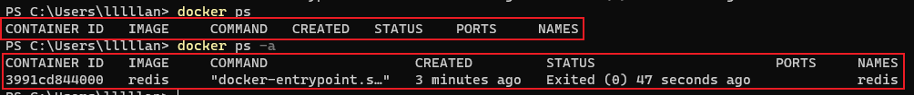

---

# 这是页面的图标
icon: docker

# 这是文章的标题
title: Docker 命令

# number | boolean
# 侧边栏按 indx 从小到大排序，false 则不出现在侧边栏
index: 4

# 写作日期
# date: 2022-01-01

# 一个页面可以有多个分类
category: 

# 一个页面可以有多个标签
tag: 

# 你可以自定义页脚
# footer: 这是测试显示的页脚
---


## 服务相关

> 注意这部分是 Linux 的命令，如果是 Windows 有眼睛的都会启动和停止

- 启动 docker 服务

  ```sh
  systemctl start docker
  ```

  

- 停止 docker 服务

  ```sh
  systemctl stop docker
  ```

  

- 重启 docker 服务

  ```sh
  systemctl restart docker
  ```

  

- 查看 docker 服务状态

  ```sh
  systemctl status docker
  ```


## 镜像相关


### 查看镜像

```sh
docker images
docker images -q # 查看所有镜像 id
```


:::center


:::


### 搜索镜像

```sh
docker search <镜像名称>
```


:::center


:::


### 拉取镜像

[Docker Hub](https://hub.docker.com/search?q=) 可以搜索镜像查看版本

```sh
docker pull <镜像名> # 默认拉取最新版本
docker pull <镜像名>:<版本号>
```


:::center




:::


### 删除镜像

```sh
docker rmi <镜像id> # 删除指定版本的镜像
docker image prune # 删除所有未被 tag 标记和未被容器使用的镜像
docker image prune -a # 删除所有未被容器使用的镜像
```


:::center


:::


## 容器相关


### 创建并启动容器

- -it 创建的容器一般称为交互式容器，-id 创建的容器一般称为守护式容器
  - -i：保持容器运行
  - -t：为容器重新分配一个伪输入终端
  - -d：以守护（后台）模式运行容器
- --name 为创建的容器命名

```sh
docker run <参数> --name <容器名> <镜像名>:<版本号>
```


::center


:::


### 创建容器

```sh
docker create --name <容器名> <镜像名>:<版本号>
```


:::center


:::


### 启动容器

```sh
docker start <容器名>
```


:::center



:::


### 进入容器

```sh
docker exec <参数> <容器名> <c>
```


:::center


:::


### 停止容器

```sh
docker stop <容器名>
```


:::center


:::


### 删除容器

```sh
docker rm <容器名>
```


:::center


:::


### 查看容器

```sh
docker ps    # 查看正在运行的容器
docker ps -a # 查看所有容器
```


:::center



:::


## 参考

- [Docker 命令大全 | 菜鸟教程 (runoob.com)](https://www.runoob.com/docker/docker-command-manual.html)
