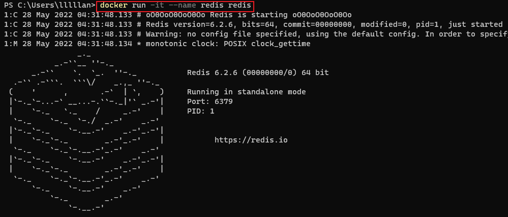

---

# 这是页面的图标
icon: command

# 这是文章的标题
title: 容器相关

# number | boolean
# 侧边栏按 indx 从小到大排序，false 则不出现在侧边栏
index: 3

# 写作日期
# date: 2022-01-01

# 一个页面可以有多个分类
category: 

# 一个页面可以有多个标签
tag: 

# 你可以自定义页脚
# footer: 这是测试显示的页脚
---


## 参数列表


- **-a stdin:** 指定标准输入输出内容类型，可选 STDIN/STDOUT/STDERR 三项；
- **-d:** 后台运行容器，并返回容器ID；
- **-i:** 以交互模式运行容器，通常与 -t 同时使用；
- **-P:** 随机端口映射，容器内部端口**随机**映射到主机的端口
- **-p:** 指定端口映射，格式为：**主机(宿主)端口:容器端口**
- **-t:** 为容器重新分配一个伪输入终端，通常与 -i 同时使用；
- **--name="nginx-lb":** 为容器指定一个名称；
- **--dns 8.8.8.8:** 指定容器使用的DNS服务器，默认和宿主一致；
- **--dns-search example.com:** 指定容器DNS搜索域名，默认和宿主一致；
- **-h "mars":** 指定容器的hostname；
- **-e username="ritchie":** 设置环境变量；
- **--env-file=[]:** 从指定文件读入环境变量；
- **--cpuset="0-2" or --cpuset="0,1,2":** 绑定容器到指定CPU运行；
- **-m :**设置容器使用内存最大值；
- **--net="bridge":** 指定容器的网络连接类型，支持 bridge/host/none/container: 四种类型；
- **--link=[]:** 添加链接到另一个容器；
- **--expose=[]:** 开放一个端口或一组端口；
- **--volume , -v:** 绑定一个卷


## 创建并启动容器

- -it 创建的容器一般称为交互式容器，-id 创建的容器一般称为守护式容器
  - -i：保持容器运行
  - -t：为容器重新分配一个伪输入终端
  - -d：以守护（后台）模式运行容器
- --name 为创建的容器命名

```sh
docker run <参数> --name <容器名> <镜像名>:<版本号>
```


::center



:::


## 创建容器

```sh
docker create --name <容器名> <镜像名>:<版本号>
```


:::center


:::


## 启动容器

```sh
docker start <容器名>
```


:::center


:::


## 进入容器

```sh
docker exec <参数> <容器名> <c>
```


:::center


:::


## 停止容器

```sh
docker stop <容器名>
```


:::center


:::


## 删除容器

```sh
docker rm <容器名>
```


:::center


:::


## 查看容器

```sh
docker ps    # 查看正在运行的容器
docker ps -a # 查看所有容器
```


:::center


:::


