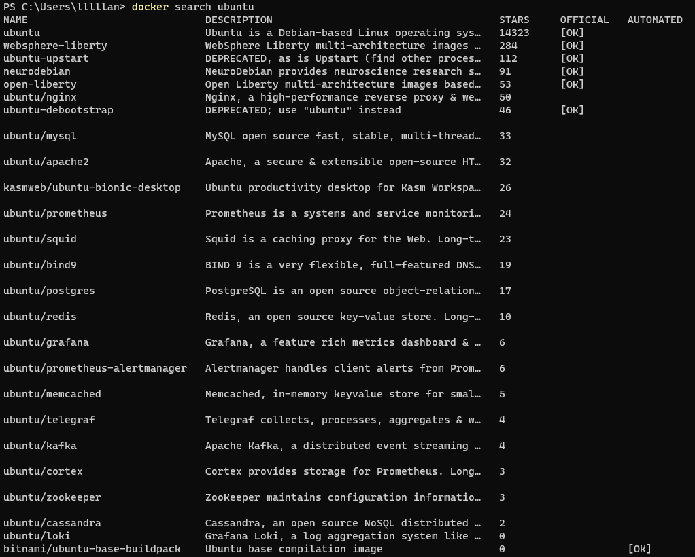
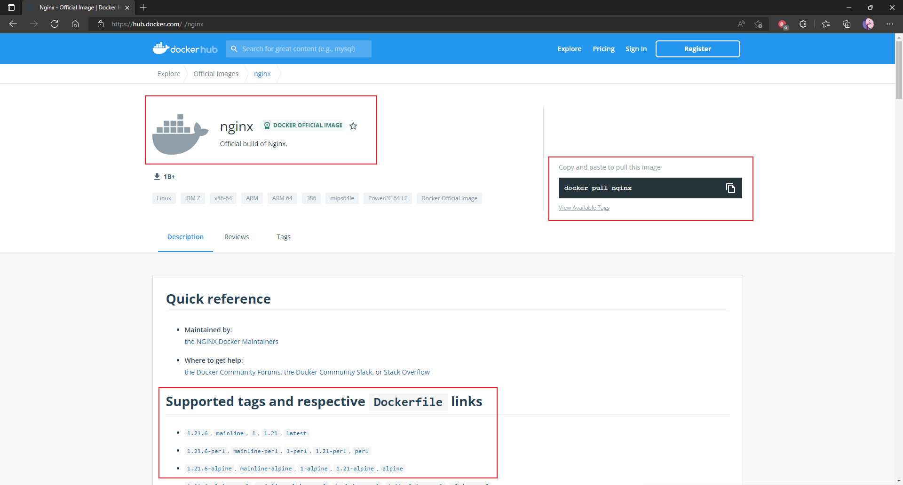

---

# 这是页面的图标
icon: command

# 这是文章的标题
title: 镜像相关

# number | boolean
# 侧边栏按 indx 从小到大排序，false 则不出现在侧边栏
index: 2

# 写作日期
# date: 2022-01-01

# 一个页面可以有多个分类
category: 

# 一个页面可以有多个标签
tag: 

# 你可以自定义页脚
# footer: 这是测试显示的页脚
---


## 查看镜像

```sh
docker images
docker images -q # 查看所有镜像 id
```


:::center


:::


## 搜索镜像

```sh
docker search <镜像名称>
```


:::center



:::


## 拉取镜像

[Docker Hub](https://hub.docker.com/search?q=) 可以搜索镜像查看版本

```sh
docker pull <镜像名> # 默认拉取最新版本
docker pull <镜像名>:<版本号>
```


:::center




:::


## 删除镜像

```sh
docker rmi <镜像id> # 删除指定版本的镜像
docker image prune # 删除所有未被 tag 标记和未被容器使用的镜像
docker image prune -a # 删除所有未被容器使用的镜像
```


:::center


:::
