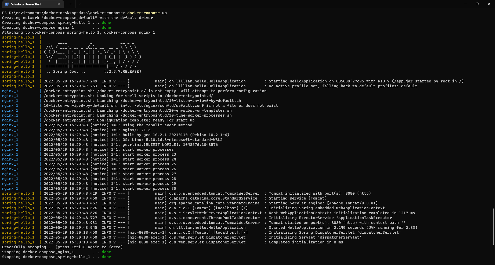
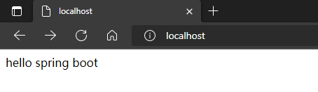

---
# 这是页面的图标
icon: docker

# 这是文章的标题
title: Docker Compose

# number | boolean
# 侧边栏按 indx 从小到大排序，false 则不出现在侧边栏
index: 7

# 写作日期
# date: 2022-01-01

# 一个页面可以有多个分类
category: 

# 一个页面可以有多个标签
tag: 

# 你可以自定义页脚
# footer: 这是测试显示的页脚
---


## Compose 安装

Windose 安装 Docker Desktop 的时候就自带了，如果是其他系统可见 [Docker Compose | 菜鸟教程 (runoob.com)](https://www.runoob.com/docker/docker-compose.html)


## 使用

- 官方文档 👉 [Overview of Docker Compose | Docker Documentation](https://docs.docker.com/compose/)
- 菜鸟教程 👉 [Docker Compose | 菜鸟教程 (runoob.com)](https://www.runoob.com/docker/docker-compose.html)


这里只是举一个简单的栗子


### 准备

两个镜像：

- nginx
- spring-hello，详见[dockerfile](./dockerfile)，或者你也可以准备其他的镜像


### docker-compose.yml

- nginx 和 spring-hello 分别是两个提前准备好的镜像
- volumes 是挂载的数据卷
- 其他一些参数不做解释了，更详细的看官方文档

```yaml
version: '3'
services:
  nginx:
    image: nginx
    ports:
      - 80:80
    links:
      - spring-hello
    volumes:
      - ./nginx/conf.d:/etc/nginx/conf.d
  
  spring-hello:
    image: spring-hello
    expose:
      - "8080"
```


### nginx 配置

`./nginx/conf.d/` 目录下创建一个 `.conf` 文件，写入以下作反向代理

```
server {

	listen 80;
	access_log off;

	location / {
		proxy_pass http://spring-hello:8080;
	}
}
```


### 构建和运行

回到创建 `docker-compose.yml` 文件的目录下执行以下命令

```sh
docker-compose up
```




这样就能运行起来了，然后访问 `localhost:80` 就能得到原来 spring-hello 运行起来的结果了


