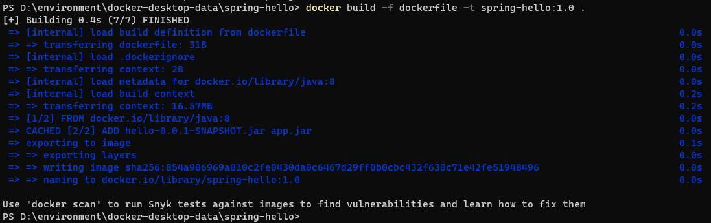
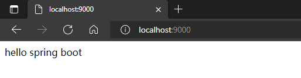

---
# 这是页面的图标
icon: docker

# 这是文章的标题
title: Dockerfile 部署项目

# number | boolean
# 侧边栏按 indx 从小到大排序，false 则不出现在侧边栏
index: 6

# 写作日期
# date: 2022-01-01

# 一个页面可以有多个分类
category: 

# 一个页面可以有多个标签
tag: 

# 你可以自定义页脚
# footer: 这是测试显示的页脚
---


## Dockerfile

Dockerfile 是一个文本文件，用来构建镜像


官方文档 👉 [Dockerfile reference | Docker Documentation](https://docs.docker.com/engine/reference/builder/)

菜鸟教程 👉 [Docker Dockerfile | 菜鸟教程 (runoob.com)](https://www.runoob.com/docker/docker-dockerfile.html)


## 准备项目

这里准备了一个最最最简单的 spring-boot 项目，运行以后访问网址 localhost:8080 会显示一行字。没有别的依赖，只需要 JDK8 就能运行，这里只是做最简单的演示

[hello-0.0.1-SNAPSHOT.jar](https://download.lllllan.cn/blog-link/spring-hello/hello-0.0.1-SNAPSHOT.jar)


## 文件编写

创建一个 `dockerfile` 文件，写入一下内容。

- FROM：当前镜像基于的父镜像
- MAINTAINER：作者信息
- ADD：添加指定文件，这里的 `hello-0.0.1-SNAPSHOT.jar app.jar` 是将当前目录下的 `hello-0.0.1-SNAPSHOT.jar` 重命名为 `app.jar` 进行保存
- CMD，执行命令 `java -jar app.jar` 运行 jar 包

```
FROM java:8
MAINTAINER lllllan <342310798@qq.com>
ADD hello-0.0.1-SNAPSHOT.jar app.jar
CMD java -jar app.jar
```


## 通过 dockerfile 构建镜像

```sh
docker build -f <dockerfile> -t <镜像名>:<版本号> .
```




## 创建容器进行测试

```sh
docker run -id -p 9000:8080 spring-hello:1.0
```


然后打开网页查看：



