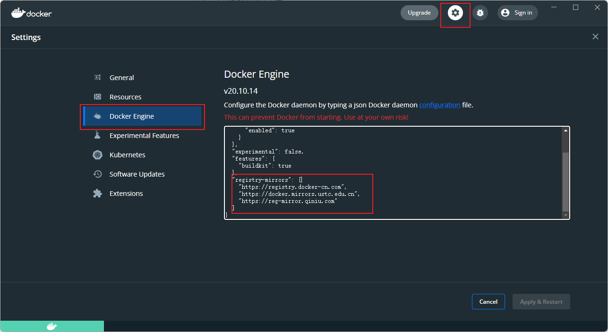

---
# 这是页面的图标
icon: docker

# 这是文章的标题
title: Docker 镜像加速

# number | boolean
# 侧边栏按 indx 从小到大排序，false 则不出现在侧边栏
index: 3

# 写作日期
# date: 2022-01-01

# 一个页面可以有多个分类
category: 

# 一个页面可以有多个标签
tag: 

# 你可以自定义页脚
# footer: 这是测试显示的页脚
---


## 镜像加速

国内从 DockerHub 拉取镜像可能会有点困难，可以配置镜像加速器

| 镜像加速器          | 镜像加速器地址                          |
| ------------------- | --------------------------------------- |
| Docker 中国官方镜像 | https://registry.docker-cn.com          |
| DaoCloud 镜像站     | http://f1361db2.m.daocloud.io           |
| Azure 中国镜像      | https://dockerhub.azk8s.cn              |
| 科大镜像站          | https://docker.mirrors.ustc.edu.cn      |
| 阿里云              | https://<your_code>.mirror.aliyuncs.com |
| 七牛云              | https://reg-mirror.qiniu.com            |
| 网易云              | https://hub-mirror.c.163.com            |
| 腾讯云              | https://mirror.ccs.tencentyun.com       |


## 添加镜像

```yaml
"registry-mirrors": [
    "https://registry.docker-cn.com",
    "https://docker.mirrors.ustc.edu.cn",
    "https://reg-mirror.qiniu.com"
]
```


