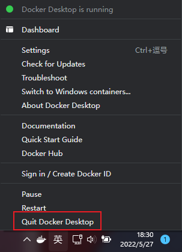
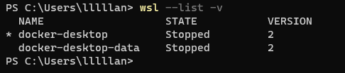
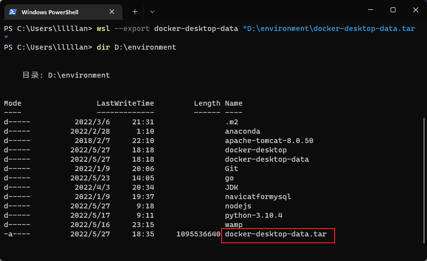
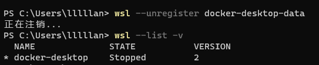
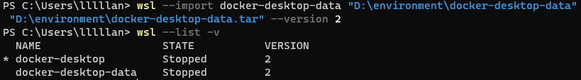
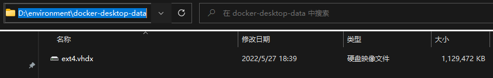

---
# 这是页面的图标
icon: docker

# 这是文章的标题
title: Docker 更改镜像安装目录

# number | boolean
# 侧边栏按 indx 从小到大排序，false 则不出现在侧边栏
index: 2

# 写作日期
# date: 2022-01-01

# 一个页面可以有多个分类
category: 

# 一个页面可以有多个标签
tag: 

# 你可以自定义页脚
# footer: 这是测试显示的页脚
---


::: danger docker 安装默认路径是 `C:\Program Files`

心疼 C 盘啊，这个也默认在 C 盘，那个也默认在 C 盘，祖上并不富裕，经不起你们都住在 C 盘呀。

:::


**Docker 本体迁移**

弄错了一步就重装 Docker 了，不太敢搞就放个链接了 👉 [windows 10 docker 从C盘迁移到其他盘_无问-西东的博客-CSDN博客](https://blog.csdn.net/jxl15680701016/article/details/106925002)

所以本篇的内容，还是针对镜像安装目录的一个更改


## 停止 Docker

::: center



:::


命令行查看停止情况：

```sh
wsl --list -v
```


::: center



:::


## 备份数据

对已有数据进行备份（很重要很重要的习惯，万一出错了，大不了恢复回去就是了）

```sh
wsl --export docker-desktop-data "D:\environment\docker-desktop-data.tar"
```

::: center



:::


## 删除旧数据

解除当前的 docker 数据虚拟盘映射，该命令执行后会删除原有 C 盘下的 ext4.vhdx 

```sh
wsl --unregister docker-desktop-data
```


:::center



:::


## 导入数据到新盘

将备份数据导入到新的虚拟盘，且指定虚拟盘的存放路径为 `D:\environment\docker-desktop-data`，命令执行完毕后会在当前目录下会生成一个 `ext4.vhdx` 虚拟磁盘

```sh
wsl --import docker-desktop-data "D:\environment\docker-desktop-data" "D:\environment\docker-desktop-data.tar" --version 2
```


:::center





:::


## 重启 Docker

到这里就结束就能重启 Docker 了，之后的镜像将会安装在这个新目录当中。

注意到和 `docker-desktop-data` 一起的还有一个 `docker-desktop`，你可以照猫画虎以相同的方式将他迁移，只是他的 "分量" 会比 data 小很多，这里不再演示。


## 参考

- [windows 10 docker 从C盘迁移到其他盘_无问-西东的博客-CSDN博客](https://blog.csdn.net/jxl15680701016/article/details/106925002)

- [windows docker 更改镜像安装目录_Liquor_J的博客-CSDN博客_windows下docker镜像安装目录](https://blog.csdn.net/qq_36226120/article/details/115185519)
