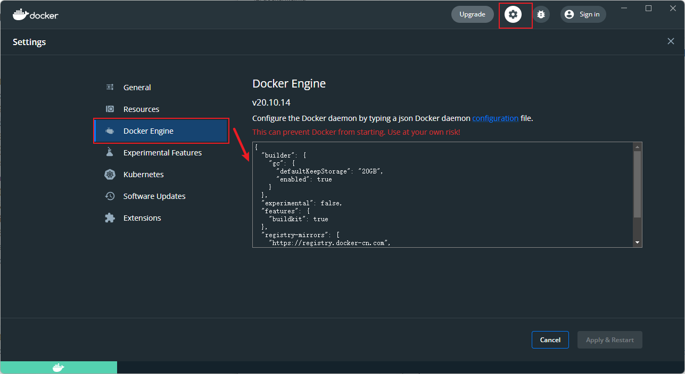
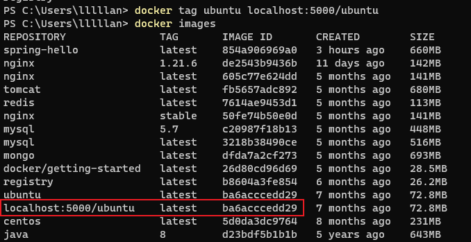
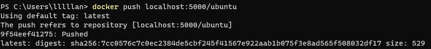
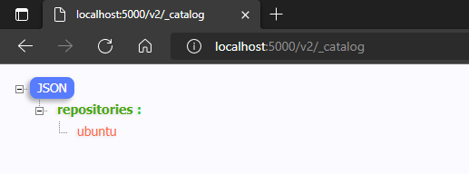

---
# 这是页面的图标
icon: docker

# 这是文章的标题
title: Docker 私有仓库

# number | boolean
# 侧边栏按 indx 从小到大排序，false 则不出现在侧边栏
index: 8

# 写作日期
# date: 2022-01-01

# 一个页面可以有多个分类
category: 

# 一个页面可以有多个标签
tag: 

# 你可以自定义页脚
# footer: 这是测试显示的页脚
---


## 搭建私有仓库

当我们的服务器无法访问网络、或者不希望我们的镜像被放到公网当中，我们可以搭建自己的私有仓库来存储和管理自己的镜像


### 拉取私有仓库镜像

```sh
docker pull registry
```


### 启动私有仓库容器

```sh
docker run -id --name registry -p 5000:5000 registry
```


### 打开浏览器访问

```
http://localhost:5000/v2/_catalog
```


### 信任私有仓库

（也许需要）修改 `daemon.json`，也可以直接再 Docker Desktop 的配置中进行修改

```
{
	"insecure-registries": ["localhost:5000"]
}
```




如果修改过，需要重启 docker 服务并且重新运行容器


## 上传镜像至私有仓库


### 标记镜像为私有仓库的镜像

```sh
docker tag <镜像名>:<版本号> <私有仓库服务器IP>:<端口号>/<镜像名>:<版本号>
```




### 上传

```sh
docker push <私有仓库服务器IP>:<端口号>/<镜像名>:<版本号>
```




### 浏览器访问查看

```
http://localhost:5000/v2/_catalog
```




## 从私有仓库拉取镜像

```sh
docker pull <私有仓库服务器IP>:<端口号>/<镜像名>:<版本号>
```

