---
# 这是页面的图标
icon: docker

# 这是文章的标题
title: Docker 数据卷

# number | boolean
# 侧边栏按 indx 从小到大排序，false 则不出现在侧边栏
index: 5

# 写作日期
# date: 2022-01-01

# 一个页面可以有多个分类
category: 

# 一个页面可以有多个标签
tag: 

# 你可以自定义页脚
# footer: 这是测试显示的页脚
---


## 数据卷概念


### 存在问题

1. Docker 容器如果意外挂掉，容器中的数据会随之消失
2. Docker 容器和外部机器不能直接交换文件
3. Docker 容器之间也无法直接进行数据交互


:::center

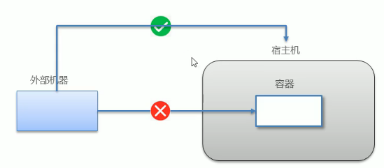

:::


### 数据卷

**数据卷式宿主机中的一个目录或文件**

- 当容器目录和数据卷目录绑定后，其中一方的修改会立即同步到另一方（可以做容器数据的持久化）
- 一个数据卷可以被多个容器同时挂在（可以做容器之间的数据交互）
- 一个容器也可以挂在多个数据卷


:::center

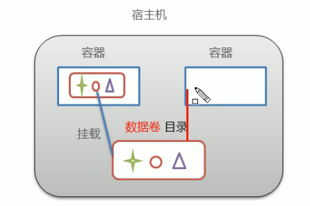

:::


## 数据卷的配置

**创建启动容器时，使用 -v 参数设置数据卷**

- 目录必须是绝对路径
- 如果目录不存在，将自动创建
- 可以挂在多个数据卷


### 配置数据卷

```sh
docker run -it --name <容器名> -v <宿主机中的绝对路径>:<容器中的绝对路径> <镜像名>:<版本号>

docker run -it --name c1 -v D:/environment/docker-volumes/for-c1:/root/volume centos
```


:::center

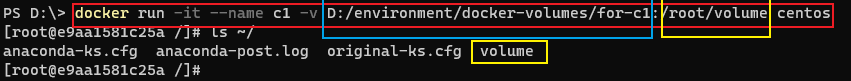

:::


### 查看容器的具体信息

```sh
docker inspect c1
```


:::center

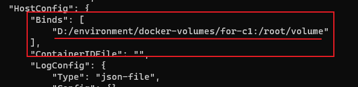

:::


### 进行修改测试


1. 本机的 volumes 目录下执行

```sh
mkdir hello.txt
```

:::center

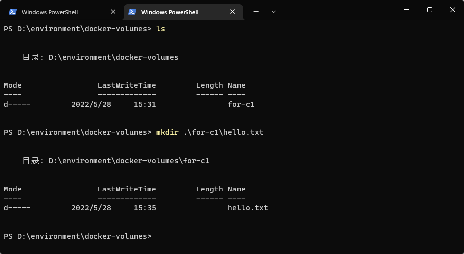

:::


2. 容器中 volume 目录下查看并执行

```sh
ls

mkdir world.txt
```

:::center

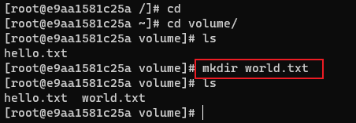

:::


3. 回到本机的 volumes 目录下查看

```sh
ls
```

:::center

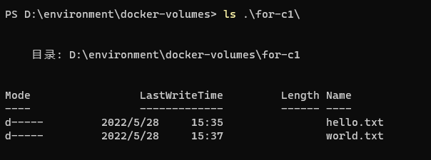

:::


::: info 多个容器挂在同一个数据卷

一个使用相同的命令，创建一个新的容器，并挂在同一个数据卷，这样多个容器之间就能直接进行数据传输了

:::


## 数据卷容器


### 创建数据卷容器

```sh
docker run -it --name volumeC -v /volume centos
docker run -it --name c1 --volumes-from volumeC centos
docker run -it --name c2 --volumes-from volumeC centos
```


:::center

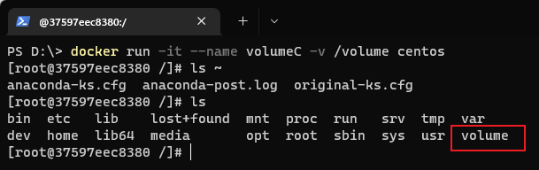

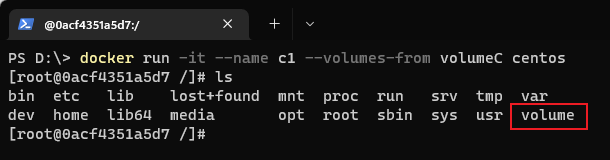

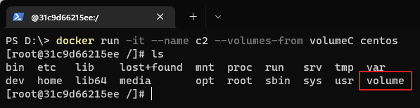

:::


### 查看 volumeC 具体信息

```sh
docker inspect volumeC
```


:::center

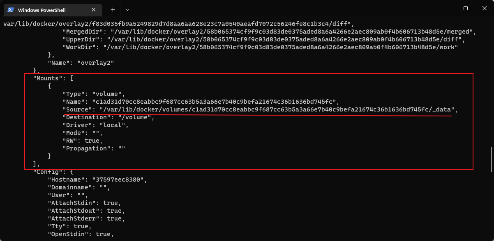

:::


### 尝试容器之间的通信

1. 在容器 c1 中执行

```sh
cd volume
mkdir hello-c2.txt
```

:::center

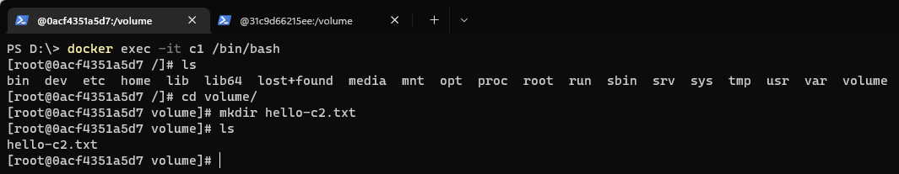

:::


2. 在容器 c2 中查看并执行

```sh
cd volume
ls
mkdir hello-c1.txt
```

:::center

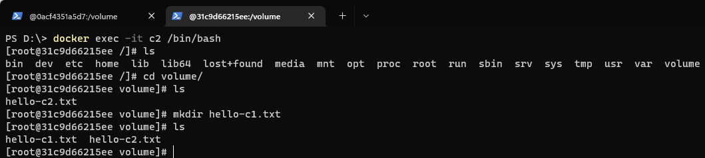

:::


## 参考

[Docker课程 | B站 黑马程序员](https://www.bilibili.com/video/BV1CJ411T7BK?p=13&share_source=copy_pc)
