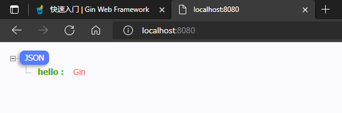

---
# 这是页面的图标
icon: gin

# 这是文章的标题
title: Gin Web Framework

# number | boolean
# 侧边栏按 indx 从小到大排序，false 则不出现在侧边栏
# index:

# 写作日期
# date: 2022-01-01

# 一个页面可以有多个分类
category: 

# 一个页面可以有多个标签
tag: 

# 你可以自定义页脚
# footer: 这是测试显示的页脚
---


## 什么是 Gin

[Gin Web Framework](https://gin-gonic.com/zh-cn/)

[Gin 开源地址](https://github.com/gin-gonic/gin)


Gin是一个使用Go语言开发的Web框架。

它提供类似Martini的API，但性能更佳，速度提升高达40倍。如果你是性能和高效的追求者, 你会爱上 Gin。


## 安装

要安装 Gin 软件包，需要先安装 Go 并设置 Go 工作区。

1. 下载并安装 gin：

```sh
$ go get -u github.com/gin-gonic/gin
```

2. 将 gin 引入到代码中：

```go
import "github.com/gin-gonic/gin"
```


## 开始

将一下代码写入创建好的 `main.go` 当中

```go
package main

import "github.com/gin-gonic/gin"

func main() {
	r := gin.Default()
	r.GET("/", func(c *gin.Context) {
		c.JSON(200, gin.H{
			"hello": "Gin",
		})
	})
	r.Run() // 监听并在 0.0.0.0:8080 上启动服务
}
```

然后, 执行 `go run main.go` 命令来运行代码：

```sh
# 运行 main.go 并且在浏览器中访问 localhost:8080/
$ go run main.go
```


