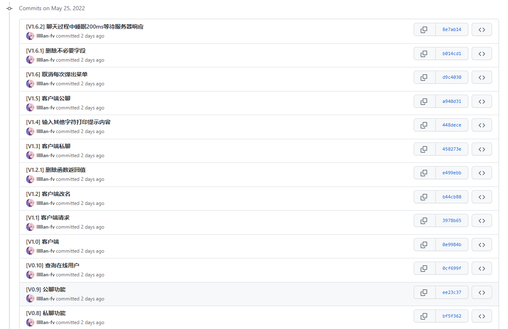

---
# 这是页面的图标
icon: community

# 这是文章的标题
title: Golang 聊天室

# number | boolean
# 侧边栏按 indx 从小到大排序，false 则不出现在侧边栏
# index:

# 写作日期
# date: 2022-01-01

# 一个页面可以有多个分类
category: 

# 一个页面可以有多个标签
tag: 

# 你可以自定义页脚
# footer: 这是测试显示的页脚
---

## 项目内容

使用 Golang 开发的简单的聊天室。

项目地址：[community_system: Golang 练手项目翻新 (github.com)](https://github.com/lllllan-fv/community_system)

基本功能：

- 客户端连接上线
- 修改用户名
- 与其他客户端用户进行私聊
- 和所用在线用户进行公聊

## 成品演示

<iframe src="https://download.lllllan.cn/blog-link/golang_community_system.mp4" scrolling="no" width="100%" height="600px" border="0" frameborder="no" framespacing="0" allowfullscreen="true"> </iframe>

## 文档说明

接下来的几篇文章，会将整个系统（其实也没几百行）分阶段地进行讲解。也可以直接到项目仓库查看历史提交，之前在写的时候，文档的顺序会大致地参考提交顺序。

