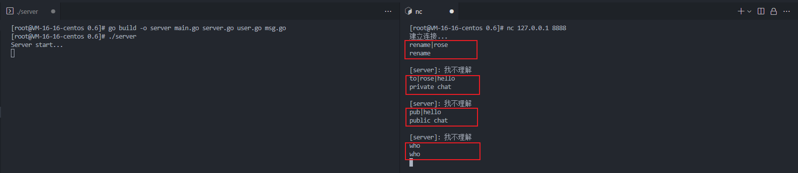

---
# 这是页面的图标
icon: community

# 这是文章的标题
title: 新增功能

# number | boolean
# 侧边栏按 indx 从小到大排序，false 则不出现在侧边栏
index: 4

# 写作日期
# date: 2022-01-01

# 一个页面可以有多个分类
category: 

# 一个页面可以有多个标签
tag: 

# 你可以自定义页脚
# footer: 这是测试显示的页脚
---


## 提供改名、私聊、公聊功能

需要根据用户的输入，去判别该用户的行为。我们为此创建 `msg.go` 并定一个新的类来区分或者说是鉴别用户行为


### Msg 类

- Msg 类，其中 str 表示整个用户输入，其中 code 表示该输入的行为类别
- 三个常量，分别是改名、私聊、公聊、查询在线用户的代号
- calCode，在新建 Msg 的时候会根据用户的输入去判定用户行为

```go
package main

import "strings"

type Msg struct {
	str  string
	code int
}

const (
	Rename = iota + 1
	PrivateChat
	PublicChat
	OnlineUserList
)

func NewMsg(str string) *Msg {
	msg := &Msg{
		str:  str,
		code: calCode(str),
	}

	return msg
}

/*
	1 rename| 改名
	2 to|toUser| 私聊
	3 pub| 公聊
	0 <else> 其他格式暂时不管
*/
func calCode(str string) int {
	n := len(strings.Split(str, "|"))

	if str == "who" {
		return OnlineUserList
	}
    
	if len(str) > 4 && str[:4] == "pub|" && n == 2 {
		return PublicChat
	}

	if len(str) > 5 && str[:3] == "to|" && n == 3 {
		return PrivateChat
	}

	if len(str) > 7 && str[:7] == "rename|" && n == 2 {
		return Rename
	}

	return 0
}
```


### 输入监听

（补充 `user.go/ListenWrite()` 方法），为每个用户的输入分配一个创建 Msg 实体，根据判定的类别去做出相应的回复

```go
// ListenWrite 监听用户输入
func (this *User) ListenWrite(server *Server) {
	buf := make([]byte, 4096)

	for {
		n, err := this.conn.Read(buf)

		...

		// 获取用户输入（去掉'\n'）
		msg := NewMsg(string(buf[:n-1]))
		switch msg.code {
		case Rename:
			this.PrintMessage("rename")
			break
		case PrivateChat:
			this.PrintMessage("private chat")
			break
		case PublicChat:
			this.PrintMessage("public chat")
			break
		case OnlineUserList:
			this.PrintMessage("who")
			break
		case 0:
			this.PrintMessage("[server]: 我不理解")
			break
		}
	}
}
```


### 执行测试

```sh
go build -o server main.go server.go user.go msg.go
./server
```

```sh
nc 127.0.0.1 8888
rename|rose
to|rose|hello
pub|hello
```




## 改名功能

规定我们的改名格式：`rename|new name`

前半段的 `rename|` 是改名指令，后面是想要修改的新名字，这里的指令判定由 `Msg` 完成


（补充 `user.go/ListenWrite()` 函数）

```go
// ListenWrite 监听用户输入
func (this *User) ListenWrite(server *Server) {
	buf := make([]byte, 4096)

	for {
        ...
        
		switch msg.code {
		case Rename:
			str := strings.Split(msg.str, "|")[1]
			newName := strings.TrimSpace(str)
			this.Rename(server, newName)
			break
        ...
		}
	}
}
```


（添加 `user.go/Renam()` 函数）

```go
func (this *User) Rename(server *Server, newName string) {
	if newName == "" {
		this.PrintMessage("[修改失败]: 用户名不能为空")
		return
	}

	_, ok := server.UserMap[newName]
	if ok {
		this.PrintMessage("[修改失败]: 当前用户名已存在 ")
		return
	}

	server.mapLock.Lock()
	delete(server.UserMap, this.Name)
	server.UserMap[newName] = this
	server.mapLock.Unlock()

	this.Name = newName
	this.PrintMessage("[修改成功]: " + newName)
}
```


## 公聊功能

公聊功能是最简单的，只要调用我们先前写好的 `Server.BroadCast()` 方法即可


（补充 `user.go/ListenWrite()` 函数）

```go
func (this *User) ListenWrite(server *Server) {
 	...
    
    	case PublicChat:
			this.PublicChat(server, split[1])
			break
    
    ...
}
```


（添加 `user.go/PublicChat()` 函数）

```go
func (this *User) PublicChat(server *Server, msg string) {
	server.BroadCast(this, msg)
}
```


## 查询用户

因为用户的改名，是没有进行广播的（当然你完全可以去广播），我们需要提供方法供用户去查询其他用户的用户名，这样我们才能指定用户进行私聊


（补充 `user.go/ListenWrite()`）

```go
func (this *User) ListenWrite(server *Server) {
 	...
    
	    case OnlineUserList:
			this.PrintOnlineUserList(server)
			break
    
    ...
}
```


（添加 `user.go/PrintOnlineUserList()` 函数）

```go
// PrintOnlineUserList 查询在线用户
func (this *User) PrintOnlineUserList(server *Server) {
	server.mapLock.Lock()
	for _, user := range server.UserMap {
		if user != this {
			this.PrintMessage("[" + user.Name + "]: 在线")
		}
	}
	server.mapLock.Unlock()
}
```


## 私聊功能


（补充 `user.go/ListenWrite()` 函数）

```go
// ListenWrite 监听用户输入
func (this *User) ListenWrite(server *Server) {
	...
    
		case PrivateChat:
			to := strings.TrimSpace(split[1])
			this.PrivateChatTo(server, to, split[2])
			break
	
	...
}
```


（添加 `user.go/PrivateChat()` 函数）

```go
// PrivateChatTo 私聊
func (this *User) PrivateChatTo(server *Server, to string, msg string) {
	if to == "" {
		this.PrintMessage("[发送失败]: 用户名不能为空")
	}

	user, ok := server.UserMap[to]
	if ok {
		this.PrintMessage("[发送成功]")
		user.PrintMessage("[私聊消息][" + this.Name + "]: " + msg)
	} else {
		this.PrintMessage("[发送失败]: 用户不存在")
	}
}
```

