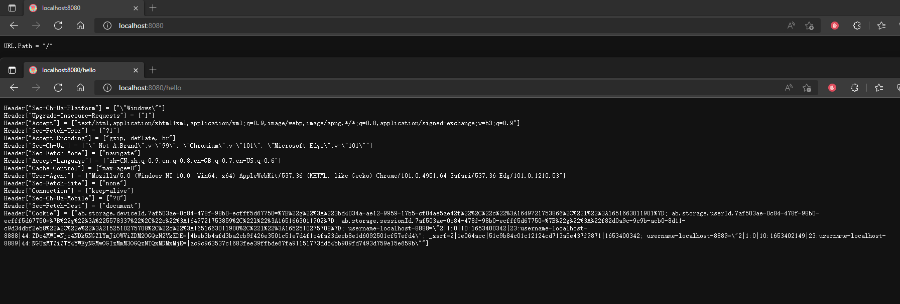

---
# 这是页面的图标
icon: web

# 这是文章的标题
title: HTTP 基础

# number | boolean
# 侧边栏按 indx 从小到大排序，false 则不出现在侧边栏
index: 1

# 写作日期
# date: 2022-01-01

# 一个页面可以有多个分类
category: 

# 一个页面可以有多个标签
tag: 

# 你可以自定义页脚
# footer: 这是测试显示的页脚
---


## 标准库启动 Web 服务

Go语言内置了 `net/http` 库，封装了 HTTP 网络编程的基础的接口，我们实现的`Gee` Web 框架便是基于 `net/http` 的。我们接下来通过一个例子，简单介绍下这个库的使用。


```go
package main

import (
	"fmt"
	"log"
	"net/http"
)

func main() {
	// 针对不同的路由，调用不同的响应函数
	http.HandleFunc("/", indexHandler)
	http.HandleFunc("/hello", helloHandler)

	// 监听 8080 的所有 http 请求
	log.Fatal(http.ListenAndServe(":8080", nil))
}

func indexHandler(writer http.ResponseWriter, request *http.Request) {
	fmt.Fprintf(writer, "URL.Path = %q\n", request.URL.Path)
}

func helloHandler(writer http.ResponseWriter, request *http.Request) {
	for k, v := range request.Header {
		fmt.Fprintf(writer, "Header[%q] = %q\n", k, v)
	}
}

```


通过网址访问：

```sh
localhost:8080/
localhost:8080/hello
```





## 实现 http.Handler 接口

前面的端口监听中没有指定实现对象 `http.ListenAndServe(":8080", nil)`，默认通过查找 http 中的回调方法。也就是通过 `http.HandleFunc()` 去处理 HTTP 请求。

从这里就是说，我们可以自定义个一个实现了 `ServeHTTP(writer http.ResponseWriter, request *http.Request)` 方法的类，通过这个类去处理 HTTP 请求。效果相同，只是我们能够更加丰富我们的处理。 

```go
package main

import (
	"fmt"
	"log"
	"net/http"
)

// Engine 自定义的空结构体
type Engine struct{}

// 结构体实现方法：ServeHTTP
// ResponseWrite：对请求做出响应
// Request：包含 HTTP 请求的所有信息（请求地址、Header、Body）
func (engine *Engine) ServeHTTP(writer http.ResponseWriter, request *http.Request) {
	switch request.URL.Path {
	case "/":
		fmt.Fprintf(writer, "URL.Path = %q\n", request.URL.Path)
		break
	case "/hello":
		for k, v := range request.Header {
			fmt.Fprintf(writer, "Header[%q] = %q\n", k, v)
		}
		break
	default:
		fmt.Fprintf(writer, "404 NOT FOUND: %s\n", request.URL)
	}
}

func main() {
	engine := new(Engine)

	// 将所有的 HTTP 请求转向我们自己定义的处理逻辑
	log.Fatal(http.ListenAndServe(":8080", engine))
}

```


## Gee 框架雏形

作为雏形，实现了路由映射表，提供了用户注册静态路由的方法，包装了启动服务的函数。


代码目录结构：

```sh
gee/
  |--gee.go
  |--go.mod
main.go
go.mod
```


### gee/gee.go

- 首先定义了类型 `HandlerFunc`，这是提供给框架用户的，用来定义路由映射的处理方法。我们在 `Engine` 中，添加了一张路由映射表 `router`，key 由请求方法和静态路由地址构成，例如 `GET-/`、`GET-/hello`、`POST-/hello`，这样针对相同的路由，如果请求方法不同，可以映射不同的处理方法(Handler)，value 是用户映射的处理方法。
- 当用户调用 `(*Engine).GET()` 方法时，会将路由和处理方法注册到映射表 *router* 中，`(*Engine).Run()` 方法，是 *ListenAndServe* 的包装。
- `Engine` 实现的 *ServeHTTP* 方法的作用就是，解析请求的路径，查找路由映射表，如果查到，就执行注册的处理方法。如果查不到，就返回 *404 NOT FOUND* 

```go
package gee

import (
	"fmt"
	"log"
	"net/http"
)

// HandlerFunc defines the request handler used by gee
type HandlerFunc func(http.ResponseWriter, *http.Request)

// Engine implement the interface of ServeHTTP
type Engine struct {
	// 路由映射表
	router map[string]HandlerFunc
}

// New is the constructor of gee.Engine
func New() *Engine {
	return &Engine{router: make(map[string]HandlerFunc)}
}

func (engine *Engine) addRoute(method string, pattern string, handler HandlerFunc) {
	key := method + "-" + pattern
	log.Printf("Route %4s - %s", method, pattern)
	engine.router[key] = handler
}

// GET defines the method to add GET request
func (engine *Engine) GET(pattern string, handler HandlerFunc) {
	engine.addRoute("GET", pattern, handler)
}

// POST defines the method to add POST request
func (engine *Engine) POST(pattern string, handler HandlerFunc) {
	engine.addRoute("POST", pattern, handler)
}

// Run defines the method to start a http server
func (engine *Engine) Run(addr string) (err error) {
	return http.ListenAndServe(addr, engine)
}

func (engine *Engine) ServeHTTP(writer http.ResponseWriter, request *http.Request) {
	key := request.Method + "-" + request.URL.Path
	if handler, ok := engine.router[key]; ok {
		handler(writer, request)
	} else {
		fmt.Fprintf(writer, "404 NOT FOUND: %s\n", request.URL)
	}
}
```


### gee/go.mod

```yaml
module gee

go 1.18
```


### main.go

使用 `GET()` 方法来添加静态路由，最后通过 `Run()` 来启动 Web 服务

```go
package main

import (
	"fmt"
	"gee"
	"net/http"
)

func main() {
	r := gee.New()

	r.GET("/", func(w http.ResponseWriter, req *http.Request) {
		fmt.Fprintf(w, "URL.Path = %q\n", req.URL.Path)
	})

	r.GET("/hello", func(w http.ResponseWriter, req *http.Request) {
		for k, v := range req.Header {
			fmt.Fprintf(w, "Header[%q] = %q\n", k, v)
		}
	})

	r.Run(":8080")
}
```


### go.mod

使用 `replace` 将 gee 指向 `./gee`

```yaml
module base3

go 1.18

require gee v0.0.0

replace gee => ./gee
```


## 参考

- [7days-golang/gee-web/day1-http-base at master · geektutu/7days-golang (github.com)](https://github.com/geektutu/7days-golang/tree/master/gee-web/day1-http-base)

- [Go语言动手写Web框架 - Gee第一天 http.Handler | 极客兔兔 (geektutu.com)](https://geektutu.com/post/gee-day1.html)
