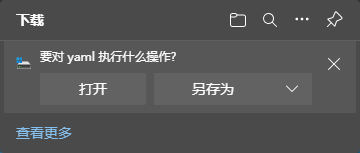

---
# 这是页面的图标
icon: gin

# 这是文章的标题
title: Response 请求响应

# number | boolean
# 侧边栏按 indx 从小到大排序，false 则不出现在侧边栏
index: 1

# 写作日期
# date: 2022-01-01

# 一个页面可以有多个分类
category: 

# 一个页面可以有多个标签
tag: 

# 你可以自定义页脚
# footer: 这是测试显示的页脚
---


## Context

在响应请求的时候，可以通过 `gin.Context` 中提供的方法提供不同的响应。


## String

:::: code-group

::: code-group-item 使用

```go
r.GET("/string", func(context *gin.Context) {
    // 输出 hello string
    context.String(http.StatusOK, "hello string")
})
```

:::

::: code-group-item 源码

```go
// String writes the given string into the response body.
func (c *Context) String(code int, format string, values ...any) {
	c.Render(code, render.String{Format: format, Data: values})
}
```

:::

::::


## HTML 渲染


:::: code-group

::: code-group-item 使用

```go
// 指定 html 文件路径
r.LoadHTMLGlob("templates/*")
r.GET("/index", func(context *gin.Context) {
   context.HTML(http.StatusOK, "index.html", gin.H{"title": "index.html"})
})
```

:::

::: code-group-item templates/index.html

```html
<html>
<h1>
    {{ .title }}
</h1>
</html>
```

:::

::: code-group-item 源码

```go
// HTML renders the HTTP template specified by its file name.
// It also updates the HTTP code and sets the Content-Type as "text/html".
// See http://golang.org/doc/articles/wiki/
func (c *Context) HTML(code int, name string, obj any) {
   instance := c.engine.HTMLRender.Instance(name, obj)
   c.Render(code, instance)
}
```

:::

::::


## JSON 响应


:::: code-group

::: code-group-item JSON-键值对

```go
r.GET("/json", func(context *gin.Context) {
    // 输出 {"url":"json"}
   context.JSON(http.StatusOK, gin.H{"url": "json"})
})
```

:::

::: code-group-item JSON-结构体

```go
r.GET("/json/struct", func(context *gin.Context) {
   type User struct { Name string }
    // 输出 {"Name":"rose"}
   context.JSON(http.StatusOK, User{Name: "rose"})
})
```

:::

::: code-group-item JSONP

**JSONP 是一种无需考虑跨域问题即可传送 JSON 数据的方法。**

```go
r.GET("/jsonp", func(context *gin.Context) {
    // 输出 hello({"url":"jsonp"});
    context.JSONP(http.StatusOK, gin.H{"url": "jsonp"})
})
```

:::

::: code-group-item SecureJSON

**使用 SecureJSON 防止 json 劫持**。如果给定的结构是数组值，则默认预置 `while(1);` 到响应体。

```go
// 你也可以使用自己的 SecureJSON 前缀
// r.SecureJsonPrefix(")]}',\n")
r.GET("/SecureJSON", func(context *gin.Context) {
    // 输出 while(1);["lena","austin","foo"]
    context.SecureJSON(http.StatusOK, []string{"lena", "austin", "foo"})
})
```

:::

::: code-group-item IndentedJSON

IndentedJSON 能够帮我们将响应的 JSON 字符串进行缩进，数据呈现将更加直观和优雅

```go
r.GET("IndentedJSON", func(context *gin.Context) {
    // 输出
    // {
    // 		"url": "IndentedJSON"
    // }
    context.IndentedJSON(http.StatusOK, gin.H{"url": "IndentedJSON"})
})
```

:::

::: code-group-item PureJSON

对于 JSON 字符串中特殊的字符串，比如 `<`，Gin 默认是转义的，比如变成 `\u003c`，但是有时候我们为了可读性，需要保持原来的字符，不进行转义，这时候我们就可以使用 `PureJSON`

```go
r.GET("/json/hello", func(context *gin.Context) {
    // 输出 {"message":"\u003ch1\u003ehello gin\u003c/h1\u003e"}
    context.JSON(http.StatusOK, gin.H{"message": "<h1>hello gin</h1>"})
})
r.GET("/json/pure", func(context *gin.Context) {
    // 输出 {"message":"<h1>hello gin</h1>"}
    context.PureJSON(http.StatusOK, gin.H{"message": "<h1>hello gin</h1>"})
})
```

:::

::: code-group-item AsciiJSON

如果要把非 `Ascii` 字符串转为 unicode 编码，Gin同样提供了非常方便的方法。

```go
r.GET("/AsciiJSON", func(context *gin.Context) {
    // 输出 {"msg":"\u76db\u610f\u4ee5\u6c5f\u6cb3\uff0c\u6c5f\u6cb3\u8865\u4e0d\u53ca\u4f60"}
    context.AsciiJSON(http.StatusOK, gin.H{"msg": "盛意以江河，江河补不及你"})
})
```

:::

::: code-group-item 源码

```go
// IndentedJSON serializes the given struct as pretty JSON (indented + endlines) into the response body.
// It also sets the Content-Type as "application/json".
// WARNING: we recommend using this only for development purposes since printing pretty JSON is
// more CPU and bandwidth consuming. Use Context.JSON() instead.
func (c *Context) IndentedJSON(code int, obj any) {
	c.Render(code, render.IndentedJSON{Data: obj})
}

// SecureJSON serializes the given struct as Secure JSON into the response body.
// Default prepends "while(1)," to response body if the given struct is array values.
// It also sets the Content-Type as "application/json".
func (c *Context) SecureJSON(code int, obj any) {
	c.Render(code, render.SecureJSON{Prefix: c.engine.secureJSONPrefix, Data: obj})
}

// JSONP serializes the given struct as JSON into the response body.
// It adds padding to response body to request data from a server residing in a different domain than the client.
// It also sets the Content-Type as "application/javascript".
func (c *Context) JSONP(code int, obj any) {
	callback := c.DefaultQuery("callback", "")
	if callback == "" {
		c.Render(code, render.JSON{Data: obj})
		return
	}
	c.Render(code, render.JsonpJSON{Callback: callback, Data: obj})
}

// JSON serializes the given struct as JSON into the response body.
// It also sets the Content-Type as "application/json".
func (c *Context) JSON(code int, obj any) {
	c.Render(code, render.JSON{Data: obj})
}

// AsciiJSON serializes the given struct as JSON into the response body with unicode to ASCII string.
// It also sets the Content-Type as "application/json".
func (c *Context) AsciiJSON(code int, obj any) {
	c.Render(code, render.AsciiJSON{Data: obj})
}

// PureJSON serializes the given struct as JSON into the response body.
// PureJSON, unlike JSON, does not replace special html characters with their unicode entities.
func (c *Context) PureJSON(code int, obj any) {
	c.Render(code, render.PureJSON{Data: obj})
}
```

:::

::::


## XML\YAML\TOML\ProtoBUf

:::: code-group

::: code-group-item XML

```go
r.GET("/xml", func(context *gin.Context) {
    // 输出
    // <map>
    // 	<url>xml</url>
    // </map>
    context.XML(http.StatusOK, gin.H{"url": "xml"})
})
```

:::

::: code-group-item YAML

```go
r.GET("/yaml", func(context *gin.Context) {
    // 提供 yaml 文件进行下载
    // url: yaml
    context.YAML(http.StatusOK, gin.H{"url": "yaml"})
})
```



:::

::: code-group-item TOML

```go
r.GET("/toml", func(context *gin.Context) {
    // 提供 toml 文件进行下载
    // url = 'toml'
    context.TOML(http.StatusOK, gin.H{"url": "toml"})
})
```

:::

::: code-group-item protobuf

```go
r.GET("/protobuf", func(context *gin.Context) {
    reps := []int64{int64(1), int64(2)}
    label := "test"
    // protobuf 的具体定义写在 testdata/protoexample 文件中。
    data := &protoexample.Test{
        Label: &label,
        Reps:  reps,
    }
    // 请注意，数据在响应中变为二进制数据
    // 将输出被 protoexample.Test protobuf 序列化了的数据
    context.ProtoBuf(http.StatusOK, data)
})
```

:::

::: code-group-item 源码

```go
// XML serializes the given struct as XML into the response body.
// It also sets the Content-Type as "application/xml".
func (c *Context) XML(code int, obj any) {
	c.Render(code, render.XML{Data: obj})
}

// YAML serializes the given struct as YAML into the response body.
func (c *Context) YAML(code int, obj any) {
	c.Render(code, render.YAML{Data: obj})
}

// TOML serializes the given struct as TOML into the response body.
func (c *Context) TOML(code int, obj interface{}) {
	c.Render(code, render.TOML{Data: obj})
}

// ProtoBuf serializes the given struct as ProtoBuf into the response body.
func (c *Context) ProtoBuf(code int, obj any) {
	c.Render(code, render.ProtoBuf{Data: obj})
}
```

:::

::::

## Redirect 页面重定向

:::: code-group

::: code-group-item 使用

```go
r.GET("/redirect", func(context *gin.Context) {
    // 跳转到 https://blog.lllllan.cn
    context.Redirect(http.StatusOK, "https://blog.lllllan.cn")
})
```

:::

::: code-group-item 源码

```go
// Redirect returns an HTTP redirect to the specific location.
func (c *Context) Redirect(code int, location string) {
	c.Render(-1, render.Redirect{
		Code:     code,
		Location: location,
		Request:  c.Request,
	})
}
```

:::

::::


## 其他好多

:::: code-group

::: code-group-item Data

```go
// Data writes some data into the body stream and updates the HTTP code.
func (c *Context) Data(code int, contentType string, data []byte) {
	c.Render(code, render.Data{
		ContentType: contentType,
		Data:        data,
	})
}
```

:::

::: code-group-item DataFromReader

```go
// DataFromReader writes the specified reader into the body stream and updates the HTTP code.
func (c *Context) DataFromReader(code int, contentLength int64, contentType string, reader io.Reader, extraHeaders map[string]string) {
	c.Render(code, render.Reader{
		Headers:       extraHeaders,
		ContentType:   contentType,
		ContentLength: contentLength,
		Reader:        reader,
	})
}
```

:::

::: code-group-item File

```go
// File writes the specified file into the body stream in an efficient way.
func (c *Context) File(filepath string) {
	http.ServeFile(c.Writer, c.Request, filepath)
}
```

:::

::: code-group-item FileFromFS

```go
// FileFromFS writes the specified file from http.FileSystem into the body stream in an efficient way.
func (c *Context) FileFromFS(filepath string, fs http.FileSystem) {
	defer func(old string) {
		c.Request.URL.Path = old
	}(c.Request.URL.Path)

	c.Request.URL.Path = filepath

	http.FileServer(fs).ServeHTTP(c.Writer, c.Request)
}
```

:::

::: code-group-item FileAttachment

```go
// FileAttachment writes the specified file into the body stream in an efficient way
// On the client side, the file will typically be downloaded with the given filename
func (c *Context) FileAttachment(filepath, filename string) {
	if isASCII(filename) {
		c.Writer.Header().Set("Content-Disposition", `attachment; filename="`+filename+`"`)
	} else {
		c.Writer.Header().Set("Content-Disposition", `attachment; filename*=UTF-8''`+url.QueryEscape(filename))
	}
	http.ServeFile(c.Writer, c.Request, filepath)
}
```

:::

::: code-group-item SSEvent

```go
// SSEvent writes a Server-Sent Event into the body stream.
func (c *Context) SSEvent(name string, message any) {
	c.Render(-1, sse.Event{
		Event: name,
		Data:  message,
	})
}
```

:::

::: code-group-item Stream

```go
// Stream sends a streaming response and returns a boolean
// indicates "Is client disconnected in middle of stream"
func (c *Context) Stream(step func(w io.Writer) bool) bool {
	w := c.Writer
	clientGone := w.CloseNotify()
	for {
		select {
		case <-clientGone:
			return true
		default:
			keepOpen := step(w)
			w.Flush()
			if !keepOpen {
				return false
			}
		}
	}
}
```

:::

::::
