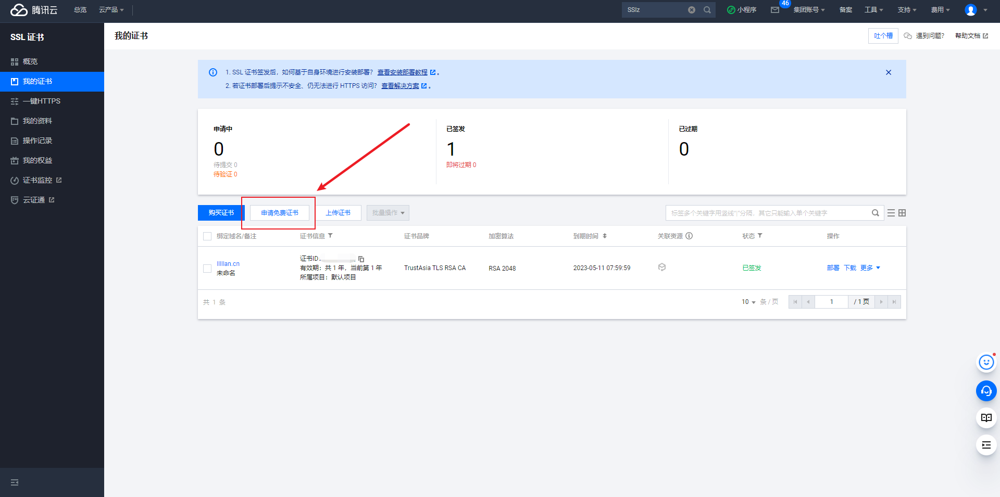
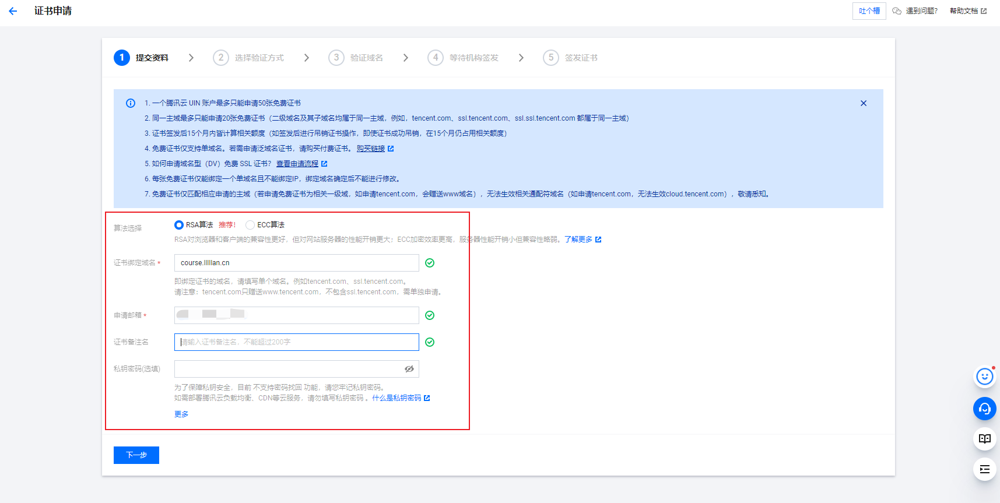
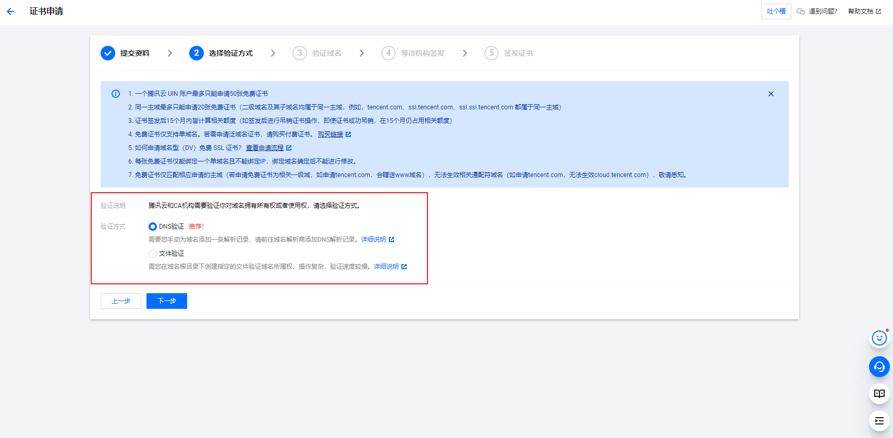
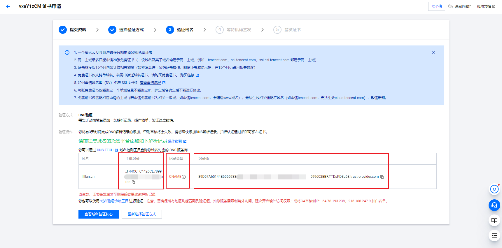
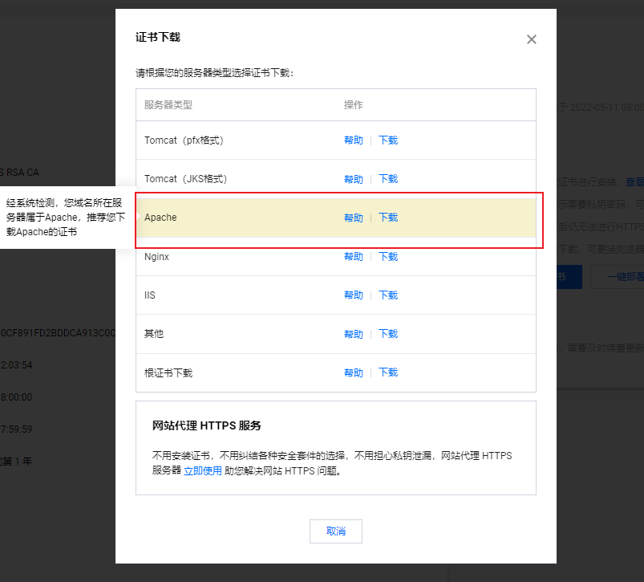
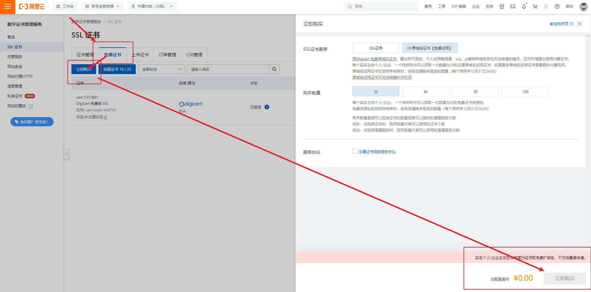
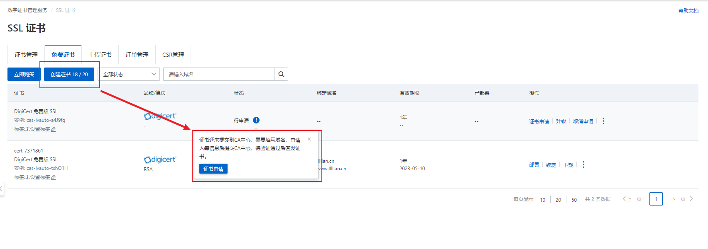

---
# 这是页面的图标
icon: Apache

# 这是文章的标题
title: Apache 配置 SSL 证书

# number | boolean
# 侧边栏按 indx 从小到大排序，false 则不出现在侧边栏
# index: 2

# 写作日期
# date: 2022-01-01

# 一个页面可以有多个分类
category: 

# 一个页面可以有多个标签
tag: 

# 你可以自定义页脚
# footer: 这是测试显示的页脚
---


## 获取 SSL 证书


### 腾讯云免费证书

[我的证书 - SSL 证书 - 控制台 (tencent.com)](https://console.cloud.tencent.com/ssl)


> 点击申请免费证书




> 填写基本资料




>选择验证方式（人家都这么推荐了，没啥必要改




>到域名管理处添加解析记录




>验证通过以后就等待证书签发并下载，要选择和自己服务器相符的证书




### 阿里云免费证书

[数字证书管理服务管理控制台 - SSL 证书 (aliyun.com)](https://yundun.console.aliyun.com/?spm=a2c1d.8251892.top-nav.5.2fd35b766YzZfY&p=cas#/certExtend/free)


> 购买免费证书




>创建证书，并点击申请




> 后续流程与腾讯云相同，~~照着指示往下做就是了~~


## 保存证书

> 将下载好的证书一并保存到 `apache/conf/ssl/` 中

你可以通过以下命令快速找到 Apache 的位置

```bash
whereis apache
```


## Apache 文件配置

> 找到配置文件 `conf/httpd.conf`，取消以下注释

注意是取消注释，即将行首的 `#` 删除

```yaml
LoadModule socache_shmcb_module modules/mod_socache_shmcb.so
LoadModule ssl_module modules/mod_ssl.so
```


> 在 `/conf/extra/httpd-ssl.conf` 文件中写入以下内容

```yaml
Listen 443
AddType application/x-x509-ca-cert .crt
AddType application/x-pkcs7-crl .crl
SSLPassPhraseDialog  builtin
SSLSessionCache  "shmcb:logs/ssl_scache(512000)"
SSLSessionCacheTimeout  300
SSLUseStapling On
SSLStaplingCache "shmcb:logs/ssl_stapling(512000)"
SSLProtocol -All +TLSv1.2 +TLSv1.3
SSLProxyProtocol -All +TLSv1.2 +TLSv1.3
SSLCipherSuite HIGH:!aNULL:!MD5:!3DES:!CAMELLIA:!AES128
SSLProxyCipherSuite HIGH:!aNULL:!MD5:!3DES:!CAMELLIA:!AES128
SSLHonorCipherOrder on
SSLCompression off
Mutex sysvsem default
SSLStrictSNIVHostCheck on
```


::: note  悄悄话

你可以注意到，在 `httpd.conf` 文件中取消注释的内容，并且你还可以检索到文件中有这么一行

```
Include conf/extra/httpd-ssl.conf
```

也就说是这波操作，是去包含 `extra/httpd-ssl.conf`文件，并且我们新写入了一些代码在该文件中。


其实呢，我们直接将上面要写入的代码，直接复制到 `httpd.conf` 文件末也是没问题的，效果是一样的。

:::


> 配置域名

```yaml
<VirtualHost 0.0.0.0:443>
		# 你自己项目存放的目录
        DocumentRoot "/data/www/default/personal_data/course/"
        
        #填写证书名称
        ServerName course.lllllan.cn
        
        #启用 SSL 功能
        SSLEngine on 
        
        #证书文件的路径
        SSLCertificateFile /usr/local/apache/conf/ssl/course.lllllan.cn.crt 
        
        #私钥文件的路径
        SSLCertificateKeyFile /usr/local/apache/conf/ssl/course.lllllan.cn.key 
        
        #证书链文件的路径
        SSLCertificateChainFile /usr/local/apache/conf/ssl/root_bundle.crt 
</VirtualHost>
```


## 重启服务器

```bash
service httpd restart
```

