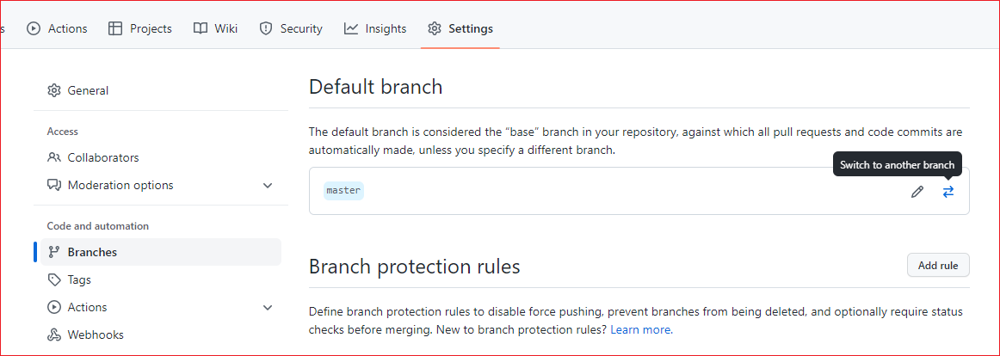
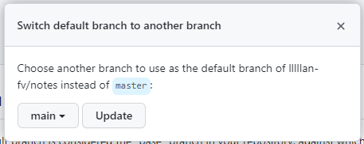

---
# 这是页面的图标
icon: github

# 这是文章的标题
title: Github master 分支迁移到 main

# number | boolean
# 侧边栏按 indx 从小到大排序，false 则不出现在侧边栏
index: 1

# 写作日期
# date: 2022-01-01

# 一个页面可以有多个分类
category: 

# 一个页面可以有多个标签
tag: 

# 你可以自定义页脚
# footer: 这是测试显示的页脚
---


::: danger 事故

把页面拉到底部，如你所见，有个 `编辑此页` 的按钮。

在这之前，你点击这个按钮会跳转到一个不存在的页面，而它的链接是这样的：

```html
https://github.com/lllllan-fv/blog/edit/main/docs/grocery/git/master-to-main.md
```

:::


## 事故起因

本地创建仓库的时候，默认分支为 `master`，而 Github 在 2020 年 10 月 1 日之后的默认分支就改成了 `main`。

因此，当我们点击 `编辑此页` 按钮的时候， Github 会默认去寻找 `main` 分支下的目录，那找得到就怪了。


## 事故处理

将 Github 仓库的 master 分支迁移到 main  分支就好了，接下来的具体步骤。


### 本地仓库创建并推送 main

> 创建并切换到分支 main

```bash
git checkout -b main
```


> 推送分支 main

```bash
git push origin main
```


### Github 修改默认分支

> 到 settings 中修改默认分支

::: center





:::


### 本地删除并推送 master

> 删除本地 master

```bash
git branch -d master
```


> 删除远程 master

```bash
git push origin :master
```


