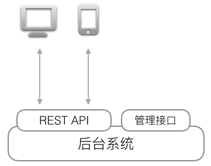

---
# 这是页面的图标
icon: note

# 这是文章的标题
title: RESTful API

# number | boolean
# 侧边栏按 indx 从小到大排序，false 则不出现在侧边栏
index: 1

# 写作日期
# date: 2022-01-01

# 一个页面可以有多个分类
category: 

# 一个页面可以有多个标签
tag: 

# 你可以自定义页脚
# footer: 这是测试显示的页脚
---

## Representational State Transfer

> REST 即 Representational State Transfer 的缩写，表现层状态转化。 如果一个架构符合 REST 原则，就称它为 RESTful 架构。

###  Resources 资源

REST 的名称 "表现层状态转化" 中，省略了主语。"表现层" 其实指的是 "资源"（Resources）的 "表现层"。
所谓 "资源"，用在互联网上就是网络上的一个实体，或者说是网络上的一个具体信息。它可以是一段文本、一张图片、一首歌曲、一种服务，总之就是一个具体的实在。

### Representation 表现层

"资源" 是一种信息实体，它可以有多种外在表现形式。我们把 "资源" 具体呈现出来的形式，叫做它的 "表现层"（Representation）。

比如，文本可以用 txt 格式表现，也可以用 HTML 格式、XML 格式、JSON 格式表现，甚至可以采用二进制格式；图片可以用 JPG 格式表现，也可以用 PNG 格式表现。

URI 只代表资源的实体，不代表它的形式。严格地说，有些网址最后的 `.html` 后缀名是不必要的，因为这个后缀名表示格式，属于 "表现层" 范畴，而 URI 应该只代表 "资源" 的位置。它的具体表现形式，应该在 HTTP 请求的头信息中用 `Accept` 和 `Content-Type` 字段指定，这两个字段才是对 "表现层" 的描述。

### State Transfer 状态转化

互联网通信协议 HTTP 协议，是一个无状态协议。这意味着，所有的状态都保存在服务器端。因此，如果客户端想要操作服务器，必须通过某种手段，让服务器端发生 "状态转化"（State Transfer）。而这种转化是建立在表现层之上的，所以就是 "表现层状态转化"。

HTTP 协议里面，四个表示操作方式的动词：GET 用来获取资源，POST 用来新建资源（也可以用于更新资源），PUT 用来更新资源，DELETE 用来删除资源。

## Web API

> 自从Roy Fielding 博士在 2000 年他的博士论文中提出 [REST](http://zh.wikipedia.org/wiki/REST)（Representational State Transfer）风格的软件架构模式后，REST 就基本上迅速取代了复杂而笨重的 SOAP，成为 Web API 的标准了。

如果我们想要获取某个电商网站的某个商品，输入 `http://localhost:3000/products/123`，就可以看到 id 为 123 的商品页面，但这个结果是 HTML 页面，它同时混合包含了 Product 的数据和 Product 的展示两个部分。对于用户来说，阅读起来没有问题，但是，如果机器读取，就很难从 HTML 中解析出 Product 的数据。

如果一个 URL 返回的不是 HTML，而是机器能直接解析的数据，这个 URL 就可以看成是一个 Web API。比如，读取 `http://localhost:3000/api/products/123`，如果能直接返回 Product 的数据，那么机器就可以直接读取。

**REST 就是一种设计 API 的模式**。最常用的数据格式是 JSON。由于 JSON 能直接被 JavaScript 读取，所以，以 JSON 格式编写的 REST 风格的 API 具有 **简单、易读、易用** 的特点。

编写 API 有什么好处呢？由于 API 就是把 Web App 的功能全部封装了，所以，**通过 API 操作数据，可以极大地把前端和后端的代码隔离，使得后端代码易于测试，前端代码编写更简单**。

此外，如果我们把前端页面看作是一种用于展示的客户端，那么 API 就是为客户端提供数据、操作数据的接口。这种设计可以获得极高的扩展性。例如，当用户需要在手机上购买商品时，只需要开发针对 iOS 和 Android 的两个客户端，通过客户端访问 API，就可以完成通过浏览器页面提供的功能，而后端代码基本无需改动。

当一个 Web 应用以 API 的形式对外提供功能时，整个应用的结构就扩展为：

把网页视为一种客户端，是REST架构可扩展的一个关键。

## 架构/风格

> REST 的设计是对万维网的整体设计，真要说起来，万维网其实只是一个系统，而 REST 就是这个系统的 **架构**。RESTful 的设计只是为了尽量利用现有万维网架构下的各种基础设施和技术，要求企业级的应用采用与 REST 同样的架构思路本来就是不合理的。RESTful 并不应当要求完全采用 REST，尤其是内部业务交互多的地方，因为 **REST 本来就是一个牺牲性能（主要是网络层面，会增加网络负担），提升统一性的架构风格**。
>
> 
>
> —— 知乎网友 [David Dong](https://www.zhihu.com/people/david-dong-20)

**REST 的本意是基于一个架构的假设（资源化），定义了一组风格，并基于这个风格形成约定、工具和支持**。思路不错。但是因为他的架构假设就是有问题的，因此后续一系列东西都建立在了一个不稳固的基础之上。同时，REST 并没有解决太多的实际问题。

### 设计目标

当时想设计的目标是解决互联网级别的信息共享和互操作问题。而我们的大量开发者工作的主要目标是【为业务系统实现一个满足功能（比如登录，交易……）/非功能需求（比如认证，性能，可扩展性……）的接口】。并且设计接口时会区分【给第三方用的开放接口】、【给UI开发定制的接口】和【内部使用的接口】等。这些接口的设计目标都和 REST 当初制定的目标有差别。其中最接近的，是【开放接口】。因此可以看到有些开放接口用 REST 实现还是很不错的，比如 github 的接口，AWS S3 的接口等。

简单总结下，写接口的目标各自不同。而REST的目标是 **实现互联网级别的信息共享系统**，这个目标和大部分开发者要实现的目标完全不同，这就不难解释为何照搬 REST 去做另一个领域的事情可能会非常别扭。

### 不实用

我们之所以要定义接口，本身的动机是做一个抽象，把复杂性隐藏起来，而绝对不是把内部的实现细节给暴露出去。REST 却反其道而行之，要求实现应该是【资源】并且这个实现细节要暴露在接口的形式上。

但一个好的接口设计就应该是简单、直观的，能够完全隐藏内部细节的，不管底层是不是资源，资源的组合还是别的什么架构。此外，让业务逻辑与接口表现一致，对系统的长期维护和演进都有极大的好处。

- REST 只提供了增删改查的基本语义，其他的语义基本上不管。
- REST 建议用 HTTP 的 status code 做错误码，以便于【统一】，实际上这非常难统一。各种业务的含义五花八门，抽象层次高低不齐，根本就无法满足需要。
  - 比如一个 404 到底是代表这个接口找不到，还是代表一个资源找不到。
  - 400 表达请求有问题，但是我想提示用户【你登录手机号输入的格式不对】，还是【你登录手机号已经被占用了】。
  - 既然 201 表示【created】，为啥 deleted 和 updated 没有对应的 status code，只能用 200 或者 204（no content）？错误处理是 web 系统里最麻烦的，最需要细心细致的地方。REST 风格在这里只能添乱。
- web 请求参数可能散布在 url path、querystring、body、header。服务器端处理对此完全没有什么章法。客户端和服务器端的研发之间还是要做约定。
- 在 url path 上的变量会对很多其他的工作带来不良影响。
  - 比如监控，本来 url 可以作为一个接口的 key 统计次数/延迟，结果 url 里出了个变量，所以自动收集 nginx 的 access log，自动做监控项目增加就没法弄了。
  - 再比如，想对接口做流量控制的计数，本来 url 可以做 key，因为有变量，就得多费点事才行。

- 现实中接口要处理的真正的问题，REST 基本上也没怎么管。比如认证、授权、流控、数据缓存（http的etag还起了点作用）、超时控制、数据压缩……。
- REST 有很多好的工具可以便利的生成对应的代码和文档，也容易形成规范。但问题是REST在实际的项目中并没有解决很多问题，也在很多时候不合用，因此产生的代码和文档也就没什么用，必须经过二次加工才能真的用起来。因此可以基于 REST+ 你的业务场景定义一个你自己的规范。

## 参考

- [浅谈REST API - ibrahim - 博客园 (cnblogs.com)](https://www.cnblogs.com/ibrahim/p/REST-API.html)
- [REST - 廖雪峰的官方网站 (liaoxuefeng.com)](https://www.liaoxuefeng.com/wiki/1022910821149312/1105000713418592)

- [WEB开发中，使用JSON-RPC好，还是RESTful API好？ - 知乎 (zhihu.com)](https://www.zhihu.com/question/28570307/answer/541465581)

