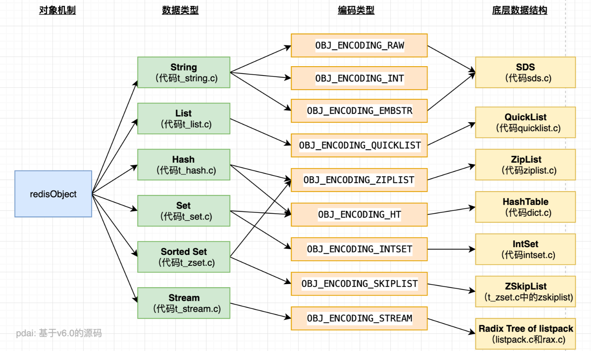

---
# 这是页面的图标
icon: structure

# 这是文章的标题
title: Redis 数据结构

# number | boolean
# 侧边栏按 indx 从小到大排序，false 则不出现在侧边栏
index: true

# 写作日期
# date: 2022-01-01

# 一个页面可以有多个分类
category: 

# 一个页面可以有多个标签
tag: 

# 你可以自定义页脚
# footer: 这是测试显示的页脚
---

## Redis 底层数据结构

也许我们可以简单了解一下，Redis 中各种数据类型的底层数据结构是怎么样的，都有什么特点、为什么这么设计。

- [SDS 简单动态字符串 | lllllan](https://blog.lllllan.cn/redis/data-structure/sds.html)
  - 字符串是 Redis 中出现最多、最重要的一环数据类型，Redis 针对 C 语言字符串的一些不足，封装了 SDS
- [ZipList 压缩链表 | lllllan](https://blog.lllllan.cn/redis/data-structure/ziplist.html)
  - 普通的 List 因为指针字段消耗更多的内存、并且不能有效利用 CPU 缓存，Redis 为此封装了更像是数组的 ZipList
- [QuickList 快表 | lllllan](https://blog.lllllan.cn/redis/data-structure/quicklist.html)
  - 然后 ZipList 具有频繁的内存分配和链式更新等缺陷，Redis 将 ZipList 作为一个链表的节点封装了 QuickList
- [Dict 哈希表 | lllllan](https://blog.lllllan.cn/redis/data-structure/dict.html)
  - 相较于常规的哈希表，Redis 实际上为了应对 rehash 准备了两个哈希表
- [整数集 IntSet | Java 全栈知识体系 (pdai.tech)](https://pdai.tech/md/db/nosql-redis/db-redis-x-redis-ds.html#整数集---intset)、[整数集合 | 小林coding (xiaolincoding.com)](https://xiaolincoding.com/redis/data_struct/data_struct.html#整数集合)
  - 当一个哈希表中存放了整数，Redis 将用 IntSet 来保存数据，为了节省更多的内存
- [跳表 ZSkipList | Java 全栈知识体系 (pdai.tech)](https://pdai.tech/md/db/nosql-redis/db-redis-x-redis-ds.html#跳表---zskiplist)、[跳表 | 小林coding (xiaolincoding.com)](https://xiaolincoding.com/redis/data_struct/data_struct.html#跳表)
  - 跳表是 Zset 的底层实现，因为哈希表不能排序、平衡树操作相对复杂，因此 Redis 采用了跳表

## 参考

- [Redis进阶 - 数据结构：底层数据结构详解 | Java 全栈知识体系 (pdai.tech)](https://pdai.tech/md/db/nosql-redis/db-redis-x-redis-ds.html)
- [Redis 数据结构 | 小林coding (xiaolincoding.com)](https://xiaolincoding.com/redis/data_struct/data_struct.html)
