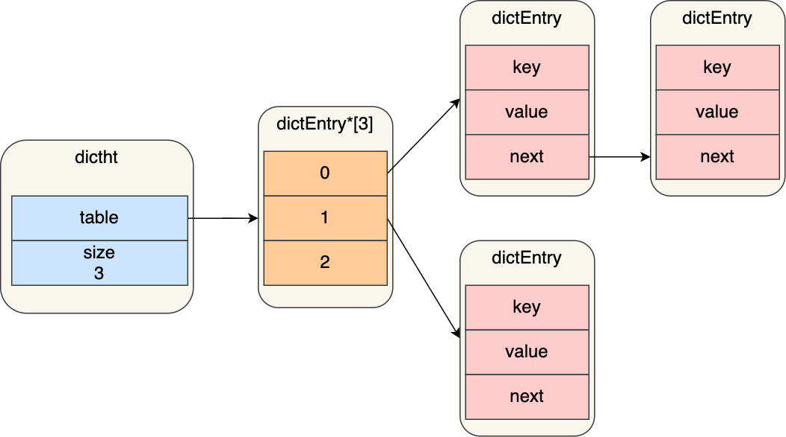

---
# 这是页面的图标
icon: structure

# 这是文章的标题
title: Dict 哈希表

# number | boolean
# 侧边栏按 indx 从小到大排序，false 则不出现在侧边栏
index: 4

# 写作日期
# date: 2022-01-01

# 一个页面可以有多个分类
category: 

# 一个页面可以有多个标签
tag: 

# 你可以自定义页脚
# footer: 这是测试显示的页脚
---


> Dict，哈希表。
>
> 注意这是 value 中的哈希表，整一个 Redis 就是一个哈希表维护的映射关系，现在 value 里还有一个哈希表类型。


## 哈希表结构




```c
typedef struct dictht{
    //哈希表数组
    dictEntry **table;
    //哈希表大小
    unsigned long size;
    //哈希表大小掩码，用于计算索引值
    //总是等于 size-1
    unsigned long sizemask;
    //该哈希表已有节点的数量
    unsigned long used;

} dictht;

typedef struct dictEntry{
    //键
    void *key;
    //值
    union{
        void *val;
        uint64_tu64;
        int64_ts64;
    } v;

    //指向下一个哈希表节点，形成链表
    struct dictEntry *next;
} dictEntry;
```


## 哈希冲突

采用的是链地址法，通过 next 指针可以将多个哈希值相同的键值对连接在一起。


## 扩容和收缩

当哈希表保存的键值对太多或者太少时，就要通过 rehash 对哈希表进行相应的扩容和收缩，对所有的键值对进行重新散列

==你应该注意到，源码中的 table 是一个二维数组，是因为其实定义了两个表==

在正常的服务请求阶段，数据的读写都经由第一个哈希表，此时另一个哈希表并没有被分配内存。扩容和收缩的时候，才会用到第二个表。

- 触发 rehash 的时候，给第二个哈希表分配空间
- 将第一个哈希表中的数据迁移到第二个哈希表中
- 迁移完成后，释放第一个哈希表，并把迁移后的哈希表设置为第一个哈希表


### 触发扩容的条件

> 负载因子 = 哈希表节点数量 / 哈希表大小

- 在没有执行 RDB 快照或者进行 AOF 重写的时候，当负载因子大于等于 1，就会触发 rehash
- 不管有没有在执行 RDB 快照和 AOF 重写，当负载因子大于等于 5（说明哈希冲突已经很严重了），都会触发 rehash


### 渐进式 rehash

当哈希表中数据较多时，rehash 需要进行的拷贝会非常耗时，为了减小对 Redis 性能的影响，Redis 采用渐进式 rehash，也就是分多次进行迁移。


> 也就是说宏观上，哈希表的读写和数据的迁移，是同时进行的。一边读写一边迁移是很容易出现问题的，看看 Redis 是怎么做的


**迁移：数据迁移，字面意思就是删除原表中的数据，写入到另一个表中**

- 查找数据：先到第一个表中查找 key，找不到再去第二个表中找，都找不到则返回 null
- 添加数据：既然都要迁移了，插入一个新的键值对就不经过第一个表了，而是直接插入第二个表


## 参考

- [Redis进阶 - 数据结构：底层数据结构详解 | Java 全栈知识体系 (pdai.tech)](https://pdai.tech/md/db/nosql-redis/db-redis-x-redis-ds.html#字典哈希表---dict)
- [Redis 数据结构 | 小林coding (xiaolincoding.com)](https://xiaolincoding.com/redis/data_struct/data_struct.html#哈希表)

