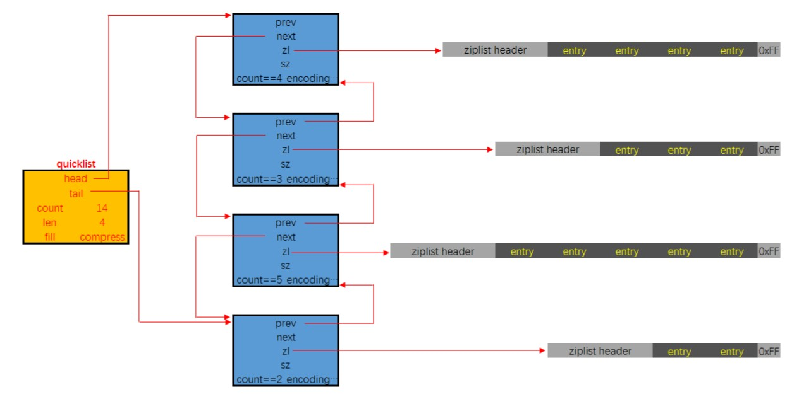

---
# 这是页面的图标
icon: structure

# 这是文章的标题
title: QuickList 快表

# number | boolean
# 侧边栏按 indx 从小到大排序，false 则不出现在侧边栏
index: 3

# 写作日期
# date: 2022-01-01

# 一个页面可以有多个分类
category: 

# 一个页面可以有多个标签
tag: 

# 你可以自定义页脚
# footer: 这是测试显示的页脚
---


> QuickList，快表。
>
> QucikList 是以 ZipList 为节点的双端链表，宏观上是一个链表，微观上每个节点都是一个 ZipList


## ZipList 的缺陷

往前翻一页你就知道了，ZipList 的优缺都很明显


### 优点

- 节省空间
- 申请连续内存能够有效利用 CPU 缓存


### 缺点

- 不预留空间和立即缩容的特点，每次写操作都会引起内存的重新分配
- 因为 prevlen 的存在，单个节点的修改可能会造成连锁更新


> Redis 为了更好利用 ZipList 的优势，合理规避劣势，**决定将 ZipList 作为链表的节点**


## QuickList 结构



- `quicklistNode`，quicklist 链表中的结点，它通过 zl 字段持有底层的 ziplist
- `quicklistLZF`，ziplist 是一段连续的内存，用 LZ4 算法压缩后，就可以包装成一个 quicklistLZF 结构
- `quicklistBookmark`，~~？没看懂是干嘛的~~
- `quicklist`，双端链表的定义。
  - head，tail 分别指向头尾指针
  - len 代表链表中的结点
  - count 指的是整个 quicklist 中的所有 ziplist 中的 entry 的数目
  - fill 字段影响着每个链表结点中 ziplist 的最大占用空间
  - compress 影响着是否要对每个 ziplist 以 LZ4 算法进行进一步压缩以更节省内存空间.
- `quicklistIter` 是一个迭代器
- `quicklistEntry` 是对 ziplist 中的 entry 概念的封装。quicklist 作为一个封装良好的数据结构，不希望使用者感知到其内部的实现，所以需要把 ziplist.entry 的概念重新包装一下

```c
/* Node, quicklist, and Iterator are the only data structures used currently. */

/* quicklistNode is a 32 byte struct describing a ziplist for a quicklist.
 * We use bit fields keep the quicklistNode at 32 bytes.
 * count: 16 bits, max 65536 (max zl bytes is 65k, so max count actually < 32k).
 * encoding: 2 bits, RAW=1, LZF=2.
 * container: 2 bits, NONE=1, ZIPLIST=2.
 * recompress: 1 bit, bool, true if node is temporarry decompressed for usage.
 * attempted_compress: 1 bit, boolean, used for verifying during testing.
 * extra: 10 bits, free for future use; pads out the remainder of 32 bits */
typedef struct quicklistNode {
    struct quicklistNode *prev;
    struct quicklistNode *next;
    unsigned char *zl;
    unsigned int sz;             /* ziplist size in bytes */
    unsigned int count : 16;     /* count of items in ziplist */
    unsigned int encoding : 2;   /* RAW==1 or LZF==2 */
    unsigned int container : 2;  /* NONE==1 or ZIPLIST==2 */
    unsigned int recompress : 1; /* was this node previous compressed? */
    unsigned int attempted_compress : 1; /* node can't compress; too small */
    unsigned int extra : 10; /* more bits to steal for future usage */
} quicklistNode;

/* quicklistLZF is a 4+N byte struct holding 'sz' followed by 'compressed'.
 * 'sz' is byte length of 'compressed' field.
 * 'compressed' is LZF data with total (compressed) length 'sz'
 * NOTE: uncompressed length is stored in quicklistNode->sz.
 * When quicklistNode->zl is compressed, node->zl points to a quicklistLZF */
typedef struct quicklistLZF {
    unsigned int sz; /* LZF size in bytes*/
    char compressed[];
} quicklistLZF;

/* Bookmarks are padded with realloc at the end of of the quicklist struct.
 * They should only be used for very big lists if thousands of nodes were the
 * excess memory usage is negligible, and there's a real need to iterate on them
 * in portions.
 * When not used, they don't add any memory overhead, but when used and then
 * deleted, some overhead remains (to avoid resonance).
 * The number of bookmarks used should be kept to minimum since it also adds
 * overhead on node deletion (searching for a bookmark to update). */
typedef struct quicklistBookmark {
    quicklistNode *node;
    char *name;
} quicklistBookmark;


/* quicklist is a 40 byte struct (on 64-bit systems) describing a quicklist.
 * 'count' is the number of total entries.
 * 'len' is the number of quicklist nodes.
 * 'compress' is: -1 if compression disabled, otherwise it's the number
 *                of quicklistNodes to leave uncompressed at ends of quicklist.
 * 'fill' is the user-requested (or default) fill factor.
 * 'bookmakrs are an optional feature that is used by realloc this struct,
 *      so that they don't consume memory when not used. */
typedef struct quicklist {
    quicklistNode *head;
    quicklistNode *tail;
    unsigned long count;        /* total count of all entries in all ziplists */
    unsigned long len;          /* number of quicklistNodes */
    int fill : QL_FILL_BITS;              /* fill factor for individual nodes */
    unsigned int compress : QL_COMP_BITS; /* depth of end nodes not to compress;0=off */
    unsigned int bookmark_count: QL_BM_BITS;
    quicklistBookmark bookmarks[];
} quicklist;

typedef struct quicklistIter {
    const quicklist *quicklist;
    quicklistNode *current;
    unsigned char *zi;
    long offset; /* offset in current ziplist */
    int direction;
} quicklistIter;

typedef struct quicklistEntry {
    const quicklist *quicklist;
    quicklistNode *node;
    unsigned char *zi;
    unsigned char *value;
    long long longval;
    unsigned int sz;
    int offset;
} quicklistEntry;
```


## 总结

1. List 作为最传统的链表，指针字段指向下一节点，但是该字段会消耗大量内存
2. ZipList 解决了消耗内存的问题，但引入了新的问题：每次写操作都会引起内存的重新分配
3. QuickList 在这两者之间做了一个平衡，使用 ZipList 作为节点能够有效节省空间和利用 CPU 缓存，并且通过控制 ZipList 的大小来规避连锁更新的问题


## 参考

- [Redis进阶 - 数据结构：底层数据结构详解 | Java 全栈知识体系 (pdai.tech)](https://pdai.tech/md/db/nosql-redis/db-redis-x-redis-ds.html#快表---quicklist)
