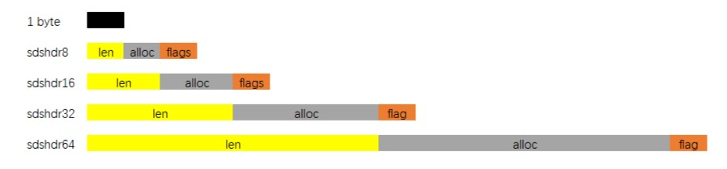

---
# 这是页面的图标
icon: structure

# 这是文章的标题
title: SDS 简单动态字符串

# number | boolean
# 侧边栏按 indx 从小到大排序，false 则不出现在侧边栏
index: 1

# 写作日期
# date: 2022-01-01

# 一个页面可以有多个分类
category: 

# 一个页面可以有多个标签
tag: 

# 你可以自定义页脚
# footer: 这是测试显示的页脚
---


> SDS，simple dynamic string 简单动态字符串。
>
> 你要先知道，Redis 是用 C 语言实现的，针对于 C 中字符串的一些不足，Redis 自己封装了一个 SDS 来满足自身特殊的需求。


## Redis 的字符串

首先要了解到字符串在 Redis 中的一个地位和重要性，已经它的一个用途，然后你才能去理解为什么要有 SDS。


1. Key 只能是字符串
2. 大部分程序使用 Redis 只用到 String 类型
3. 其他类型中保存的元素还是 String


应该说 String 在 Redis 中扮演着很重要的角色，因此 Redis 为此量身定做了一个 SDS 来更高效地完成任务。


## C 语言字符串的不足

我认为不足，都是相对的。如果大家都知道 C 语言的字符串有不足，那为什么还要保留它呢。因为 char 是最基础的，你可以在你的需求之上，去做有利于自己要求的封装。


### \0 结尾

字符数组中的 `\0` 表示字符串的结束。

这样设计的好处是，你可以使用最少的空间，来标识一个字符串的结束。但是问题是：

1. 想要计算一个字符串的长度，必须从头到尾遍历到 `\0` 为止，因此 **获取字符串长度的复杂度为 $O(n)$**
2. 因为 `\0` 用来标识结尾，那么中间就不能出现，因此 **不能用来保存像图像、音频、视频之类的二进制数据**


### 不记录缓冲区大小

只有创建数组的本人，知道自己申请了多少空间，C 语言本身是不会对此做记录的。在执行字符串的拼接时，就要求有足够的空间能够去容纳新字符串的加入。

**如果拼接字符串的时候出现总长度超过了原来申请的空间，就会造成缓冲区溢出。**


### 内存的重新分配

还是因为不记录缓冲区大小的原因，C 语言在修改字符串时必须重新分配内存。

- **如果新的字符串超过的原来申请的内存空间，会造成缓冲区溢出**
- **如果新的字符串比申请的内存空间小很多，则会造成内存泄露**


## SDS 结构

::: center


:::


> O(1) 获取字符串长度

不用从头遍历到尾去寻找结束符号 `\0`，只要直接查看 len 就能获取字符串长度


> 二进制安全

因为不再需要 `\0` 来表示字符串的结束，因此可以存储包含 `\0` 的数据


> 不会发生缓冲区溢出

当对字符串做修改时，对于字符串长度边长的情况，需要先判断缓冲区大小是否充足，Redis 会根据需要自动扩容。（ **小于 1MB 翻倍扩容，大于 1MB 按 1MB 扩容**，合理的扩容机制能有效减少内存分配的次数 ）


> 节省内存空间

SDS 设计了五种不同类型的数据结构， **为了能够灵活保存不同大小的字符串，从而有效节省内存**



```c
struct __attribute__ ((__packed__)) sdshdr5 {
    unsigned char flags; /* 3 lsb of type, and 5 msb of string length */
    char buf[];
};
struct __attribute__ ((__packed__)) sdshdr8 {
    uint8_t len; /* used */
    uint8_t alloc; /* excluding the header and null terminator */
    unsigned char flags; /* 3 lsb of type, 5 unused bits */
    char buf[];
};
struct __attribute__ ((__packed__)) sdshdr16 {
    uint16_t len; /* used */
    uint16_t alloc; /* excluding the header and null terminator */
    unsigned char flags; /* 3 lsb of type, 5 unused bits */
    char buf[];
};
struct __attribute__ ((__packed__)) sdshdr32 {
    uint32_t len; /* used */
    uint32_t alloc; /* excluding the header and null terminator */
    unsigned char flags; /* 3 lsb of type, 5 unused bits */
    char buf[];
};
struct __attribute__ ((__packed__)) sdshdr64 {
    uint64_t len; /* used */
    uint64_t alloc; /* excluding the header and null terminator */
    unsigned char flags; /* 3 lsb of type, 5 unused bits */
    char buf[];
};
```


## 参考

- [Redis进阶 - 数据结构：底层数据结构详解 | Java 全栈知识体系 (pdai.tech)](https://pdai.tech/md/db/nosql-redis/db-redis-x-redis-ds.html#简单动态字符串---sds)
- [Redis 数据结构 | 小林coding (xiaolincoding.com)](https://xiaolincoding.com/redis/data_struct/data_struct.html#sds)
