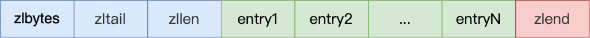
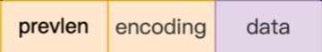

---
# 这是页面的图标
icon: structure

# 这是文章的标题
title: ZipList 压缩链表

# number | boolean
# 侧边栏按 indx 从小到大排序，false 则不出现在侧边栏
index: 2

# 写作日期
# date: 2022-01-01

# 一个页面可以有多个分类
category: 

# 一个页面可以有多个标签
tag: 

# 你可以自定义页脚
# footer: 这是测试显示的页脚
---


> ZipList，压缩链表。
>
> 链表的优势很明显，但是有一点「**链表的结点不需要申请连续的空间**」，却也是链表的缺点。


## 链表的不足


### 不能很好利用 CPU 缓存

从程序开发的角度，链表不需要申请连续空间应该是一个非常重要的优势，这样我们可以充分利用碎片空间来维护一个足够长的链表。

==但也正因为空间不连续，不能很好地利用 CPU 缓存。==


### 内存开销大

对比数组，链表中的节点还需要额外的空间来指向下一个节点，这是额外的内存开销。


> **而 Redis 又是运行在内存之上的，对于性能和内存开销需要额外重视，因此普通的链表就显得有些难堪重任。**


## ZipList 结构



- `zlbytes` 记录整个压缩列表占用对内存字节数；
- `zltail` ziplist 中最后一个 entry 的偏移量，用于快速定位最后一个 entry，以快速完成 push 等操作；
- `zllen` 记录压缩列表包含的节点数量；
- `zlend` 标记压缩列表的结束点，固定值 0xFF（十进制 255）。


## Entry 结构

```c
// 存储 string 的一般结构
<prevlen> <encoding> <entry-data>

// 存储 int 的短结构 
<prevlen> <encoding>
```


::: center



:::

- `prevlen`，记录了「前一个节点」的长度；
- `encoding`，记录了当前节点实际数据的类型以及长度；
- `data`，记录了当前节点的实际数据；


```c
/* We use this function to receive information about a ziplist entry.
 * Note that this is not how the data is actually encoded, is just what we
 * get filled by a function in order to operate more easily. */
typedef struct zlentry {
    unsigned int prevrawlensize; /* Bytes used to encode the previous entry len*/
    unsigned int prevrawlen;     /* Previous entry len. */
    unsigned int lensize;        /* Bytes used to encode this entry type/len.
                                    For example strings have a 1, 2 or 5 bytes
                                    header. Integers always use a single byte.*/
    unsigned int len;            /* Bytes used to represent the actual entry.
                                    For strings this is just the string length
                                    while for integers it is 1, 2, 3, 4, 8 or
                                    0 (for 4 bit immediate) depending on the
                                    number range. */
    unsigned int headersize;     /* prevrawlensize + lensize. */
    unsigned char encoding;      /* Set to ZIP_STR_* or ZIP_INT_* depending on
                                    the entry encoding. However for 4 bits
                                    immediate integers this can assume a range
                                    of values and must be range-checked. */
    unsigned char *p;            /* Pointer to the very start of the entry, that
                                    is, this points to prev-entry-len field. */
} zlentry;
```

> 当我们往压缩列表中插入数据时，压缩列表就会根据数据是字符串还是整数，以及数据的大小，会使用不同空间大小的 prevlen 和 encoding 这两个元素里保存的信息，**这种根据数据大小和类型进行不同的空间大小分配的设计思想，正是 Redis 为了节省内存而采用的**。


### prevlen 编码

当前一个元素长度小于 254（255 用于 zlend）的时候，prevlen 长度为 1 个字节，值即为前一个 entry 的长度，如果长度大于等于 254 的时候，prevlen 用 5 个字节表示，第一字节设置为 254，后面 4 个字节存储一个小端的无符号整型，表示前一个 entry 的长度；

```c
//长度小于254结构
<prevlen from 0 to 253> <encoding> <entry>

//长度大于等于254
0xFE <4 bytes unsigned little endian prevlen> <encoding> <entry>
```


### encoding 编码

encoding 的长度和值根据保存的是 int 还是 string，还有数据的长度而定；

前两位用来表示类型，当为 `11` 时，表示 entry 存储的是 int 类型，其它表示存储的是 string；


### int 存储

在 entry 中存储的是 int 类型时，encoding 和 entry-data 会合并在 encoding 中表示，此时没有 entry-data 字段；

**redis 中，在存储数据时，会先尝试将 string 转换成 int 存储，节省空间；**

此时 entry 结构：`<prevlen> <encoding>`


## ZipList 的缺陷

1. ziplist 不会预留内存空间，并且在移除结点后，也是立即缩容，这代表每次写操作都会进行内存分配操作
2. 节点的扩容可能会导致「连锁更新」


### 连锁更新

回头看 prevlen 的编码规则，假设现在有几个连续的倒霉节点，其节点长度全部小于 254 字节，那么这些节点的 prevlen 只需要使用一个字节。

如果其中节点 $entry_i$ 的扩容，导致其长度超过 254，继而影响了下一个节点 $entry_{i + 1}$ 的 prevlen 长度，同时被影响的还有该节点的长度，不幸的是这个节点长度也超过了 254，然后继续影响下一个节点。

 更详细可以看这篇文章的图示👉 [Redis 数据结构 | 小林coding (xiaolincoding.com)](https://xiaolincoding.com/redis/data_struct/data_struct.html#连锁更新)


## 参考

- [Redis 数据结构 | 小林coding (xiaolincoding.com)](https://xiaolincoding.com/redis/data_struct/data_struct.html#链表)
- [Redis进阶 - 数据结构：底层数据结构详解 | Java 全栈知识体系 (pdai.tech)](https://pdai.tech/md/db/nosql-redis/db-redis-x-redis-ds.html#压缩列表---ziplist)
