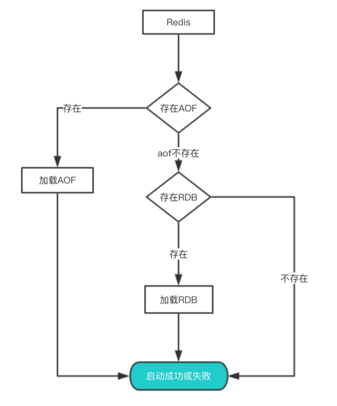

---
# 这是页面的图标
icon: persistence

# 这是文章的标题
title: Redis 持久化

# number | boolean
# 侧边栏按 indx 从小到大排序，false 则不出现在侧边栏
index: true

# 写作日期
# date: 2022-01-01

# 一个页面可以有多个分类
category: 

# 一个页面可以有多个标签
tag: 

# 你可以自定义页脚
# footer: 这是测试显示的页脚
---

## Redis 持久化

### 为什么需要持久化

要明确，Redis 是基于内存的数据库。如果服务一旦宕机，内存中的数据将全部丢失。

有一种很容易想到的方案，就是将数据存入后端数据库，但是数据库存在性能瓶颈，当数据量大到一定程度，数据的恢复会给数据库带来巨大的压力、并且恢复速度也不太理想。

而 Redis 存在的意义，很大程度就是为了提升效率，显然这种通过数据库的恢复方案并不理想。

### 持久化方案

**目前 Redis 支持的有 RDB、AOF 两种持久化方案。**

- [RDB 持久化](rdb)
- [AOF 持久化](aof)

### 数据恢复

1. redis 重启时先判断是否开启 AOF，如果开启就优先加载 AOF 文件
   - 如果 AOF 存在就去加载 AOF 文件，加载成功的话 redis 重启成功
   - 如果加载失败，打印日志表示启动失败，此时可以修复 AOF 文件后重新启动
2. 如果 AOF 文件不存在，那么 redis 就会去加载 RDB 文件，如果 RDB 文件不存在，redis 直接启动成功

**AOF 保存的数据更完整，因此会有优先加载 AOF。**

::: center

:::

### RDB 和 AOF 混合

- RDB 是对某一时刻内存数据的一次快照，优点是数据恢复速度快、问题是高性能和高可用之间的取舍。
- AOF 是对所有写才做的记录，优点是能较快地保存、问题是消耗内存更高恢复数据更慢。

==Redis 提出混合使用 AOF 日志和 RDB 的方法，即按照一定频率地执行内存快照，两次快照期间使用 AOF 日志记录期间的所有命令。==

## 参考

- [Redis进阶 - 持久化：RDB和AOF机制详解 | Java 全栈知识体系 (pdai.tech)](https://pdai.tech/md/db/nosql-redis/db-redis-x-rdb-aof.html)
- [RDB 快照是怎么实现的？ | 小林coding (xiaolincoding.com)](https://xiaolincoding.com/redis/storage/rdb.html#rdb-和-aof-合体)

