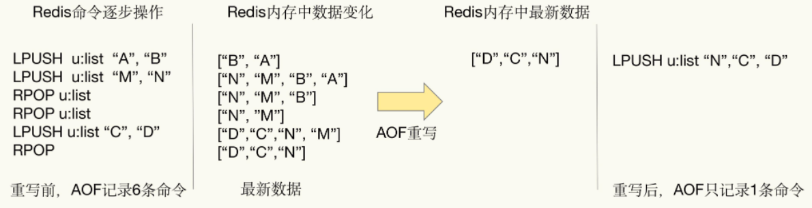

---
# 这是页面的图标
icon: persistence

# 这是文章的标题
title: AOF 持久化

# number | boolean
# 侧边栏按 indx 从小到大排序，false 则不出现在侧边栏
index: 2

# 写作日期
# date: 2022-01-01

# 一个页面可以有多个分类
category: 

# 一个页面可以有多个标签
tag: 

# 你可以自定义页脚
# footer: 这是测试显示的页脚
---

> AOF，Append Only File。
>
> AOF 持久化是 Redis 的写后日志，Redis 先执行命令，把数据写入内存，然后才记录日志。

PS：大多数的数据库采用的是写前日志（WAL），例如 MySQL，通过写前日志和两阶段提交，实现数据和逻辑的一致性。


##  写后日志

> 好处：

- **避免额外的检查开销**，对于写后日志，Redis 在记录日志的时候不需要对这些命令进行语法检查。而对于写前日志，如果不进行语法检查，日志中可能回记录错误的命令，在日志恢复数据的时候就可能会出错。
- 不会阻塞当前的写操作


> 潜在风险：

- 如果写操作完成、还没写日志的时候宕机了，会丢失数据
- 主线程写磁盘压力大，导致写盘慢、阻塞后续操作


## 如何实现 AOF

> AOF 日志记录 Redis 的每个写命令步骤分为：命令追加、文件写入、文件同步

- 命令追加，服务器在执行完一个写命令之后，会以协议格式将被执行的命令追加到服务器的 aof_buf 缓冲区
- 文件写入和同步，根据一定的时机将 aof_buf 缓冲区的内容写入磁盘文件

|  配置项  |   写回时机   |           优点           |               缺点               |
| :------: | :----------: | :----------------------: | :------------------------------: |
|  always  |   同步写回   | 可靠性高，数据基本不丢失 | 每个写命令都要落盘，性能影响较大 |
| everysec |   每秒写回   |         性能适中         |        宕机时丢失一秒数据        |
|    no    | 操作系统控制 |          性能好          |        宕机时丢失数据较多        |

 ==写回时机其实是性能和可靠性保证之间的取舍==


```sh
# appendonly参数开启AOF持久化
appendonly no

# AOF持久化的文件名，默认是appendonly.aof
appendfilename "appendonly.aof"

# AOF文件的保存位置和RDB文件的位置相同，都是通过dir参数设置的
dir ./

# 同步策略
# appendfsync always
appendfsync everysec
# appendfsync no

# aof重写期间是否同步
no-appendfsync-on-rewrite no

# 重写触发配置
auto-aof-rewrite-percentage 100
auto-aof-rewrite-min-size 64mb

# 加载aof出错如何处理
aof-load-truncated yes

# 文件重写策略
aof-rewrite-incremental-fsync yes
```


## AOF 重写

AOF 会记录每个写操作命令，随着时间和数据的增加，文件会变得越来越大。我们可以认为追加写的方式对比快照可能存在冗余。




### AOF 重写会阻塞吗

AOF 重写过程是由后台进程 `bgrewriteaof` 来完成的，**在 fork 子进程时会阻塞主进程。**

主线程 fork 出后台的 bgrewriteaof 子进程，fork 会把主线程的内存拷贝一份给 bgrewriteaof 子进程，这里面就包含了数据库的最新数据。然后，bgrewriteaof 子进程就可以在不影响主线程的情况下，逐一把拷贝的数据写成操作，记入重写日志。


### 何时重写

- `auto-aof-rewrite-min-size`，执行 AOF 重写的最小文件大小，默认 64MB
- `auto-aof-rewrite-percentage`，${(当前文件大小 - 上一次 aof 文件大小)} / 上一次重写后 aof 的大小$


### 一个拷贝，两处日志

在 fork 出子进程时的拷贝、以及在重写时，如果有新的数据写入，**主进程会将命令记录到两个 aof 日志内存缓冲区中**。


### 重写文件的替换

而在 bgrewriteaof 子进程完成会日志文件的重写操作后，会提示主线程已经完成重写操作，主线程会将 AOF 重写缓冲中的命令追加到新的日志文件后面。这时候在高并发的情况下，AOF 重写缓冲区积累可能会很大，这样就会造成阻塞，Redis 后来通过 Linux 管道技术让 aof 重写期间就能同时进行回放，这样 aof 重写结束后只需回放少量剩余的数据即可。

==最后通过修改文件名的方式，保证文件切换的原子性。==

在 AOF 重写日志期间发生宕机的话，因为日志文件还没切换，所以恢复数据时，用的还是旧的日志文件。


## 参考

- [AOF 持久化 | Java 全栈知识体系 (pdai.tech)](https://pdai.tech/md/db/nosql-redis/db-redis-x-rdb-aof.html#aof-持久化)
- [AOF 持久化是怎么实现的？ | 小林coding (xiaolincoding.com)](https://xiaolincoding.com/redis/storage/aof.html)

