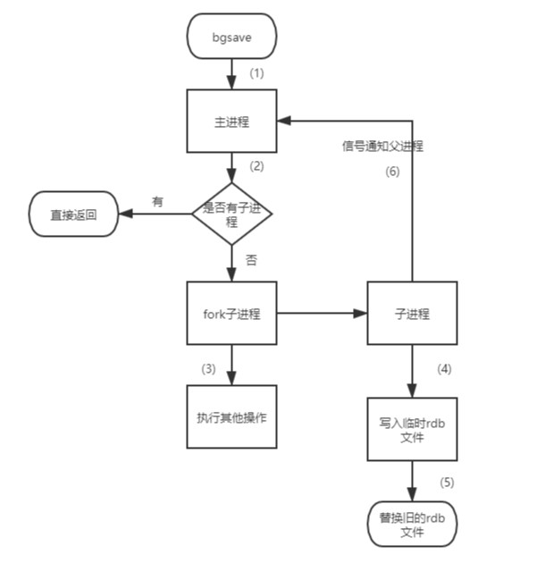
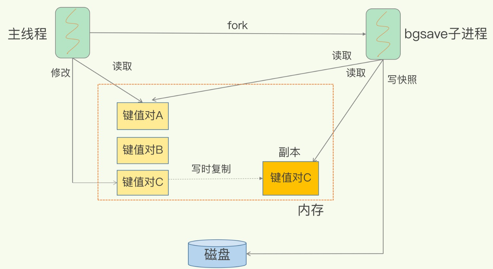

---
# 这是页面的图标
icon: persistence

# 这是文章的标题
title: RDB 持久化

# number | boolean
# 侧边栏按 indx 从小到大排序，false 则不出现在侧边栏
index: 1

# 写作日期
# date: 2022-01-01

# 一个页面可以有多个分类
category: 

# 一个页面可以有多个标签
tag: 

# 你可以自定义页脚
# footer: 这是测试显示的页脚
---

> RDB，Redis Database 快照/内存快照。
>
> RDB 持久化是把当前进程数据生成快照保存到磁盘上的过程，是一种 **全量复制**。


## 触发方式


### 手动触发

**手动触发分别对应 `save` 和 `bgsave` 命令**


- `save`，**阻塞** 当前 Redis 服务器，知道 RDB 过程完成位置，对于内存较大的实例会造成长时间阻塞，线上环境不建议使用。
- `bgsave`，创建一个子进程来进行对 RDB 文件的写入，只有在 fork 阶段才存在阻塞，时间较短。


::: center



:::


### 自动触发

Redis 的自动触发是满足特定条件下，自动执行 `bgsave` 命令。

- `redis.conf` 文件中配置 `save m n`，即满足在 m 秒内有 n 此修改时，会自动触发 bgsave
- 主从复制时，从节点要从主节点进行全量复制时也会触发 bgsave，生成当时的快照发送给从节点
- 执行 `debug reload` 命令重新加载 redis 时也会触发 bgsave
- 默认情况下如果没有开启 AOF 持久化，在执行 `shutdown` 命令时会触发 bgsave


> redis.conf 配置

```yaml
# 周期性执行条件的设置格式为
# save <seconds> <changes>

# 默认的设置为：
save 900 1
save 300 10
save 60 10000

# 以下设置方式为关闭RDB快照功能
save ""

# 文件名称
dbfilename dump.rdb

# 文件保存路径
dir /home/work/app/redis/data/

# 如果持久化出错，主进程是否停止写入
stop-writes-on-bgsave-error yes

# 是否压缩
rdbcompression yes

# 导入时是否检查
rdbchecksum yes
```


## 写时复制

`bgsave` 命令是创建了一个子进程来完成对 RDB 文件的写操作，目的就是为了不阻塞子进程，好让 Redis 继续支持读写操作。

那在 RDB 持久化期间，是如何保证主进程的读写操作和子进程的保存快照不冲突的呢？


> **写时复制**，当进程间都只有读操作，不会对数据进行修改，此时允许两个进程对同一内存进行读取；当主进程要对数据进行修改时，会创建一个副本进行修改，子进程依然从原内存地址进行读取。

（注：这里有一处问题，我没有翻阅官方文档，只是百度了一些博客，发现对这个副本的说法并不统一：有的说主进程在副本上修改，有的说副本供子进程进行读取，我不确定是哪种说法，暂时理解这个思想即可）





## RDB 持久化过程中服务崩溃

**在没有将数据全部写入磁盘之前，这次快照操作都不能算成功。**

如果出现了服务崩溃的情况，将以上一次完整的 RDB 快照文件作为恢复内存数据的参考。也就是说，在快照操作过程中不能影响上一次的备份数据。Redis 服务会在磁盘上创建一个临时文件进行数据操作，待操作成功后才会用这个临时文件替换掉上一次的备份。


## RDB 持久化间隔

你想要保证数据的 "安全"，想要进行持久化，就必然需要消耗资源、消耗时间去进行保存。这是一种取舍。

- 如果你不想因为宕机丢失太多的数据，你可以以一个较小的时间间隔去进行 RDB 持久化，但是代价是消耗 CPU 和增加磁盘的压力。
- 如果你不想影响 Redis 的性能，以一个较大的时间建个去进行 RDB 持久化，当发生宕机的时候你可能会丢失较多的数据。


全量复制的麻烦就是你需要全部的、从头到尾的进行复制，或者我们也可以考虑一下 **增量复制**，只需要记录某一时刻之后进行的改动。


## RDB 的优缺点


> 优点：

- RDB 文件是某个时间节点的快照，默认使用 LZF 算法进行压缩，压缩后的文件体积远远小于内存大小，适用于备份、全量复制等场景；
- Redis 加载 RDB 文件恢复数据要远远快于 AOF 方式；


> 缺点：

- RDB 方式实时性不够，无法做到秒级的持久化；
- 每次调用 bgsave 都需要 fork 子进程，fork 子进程属于重量级操作，频繁执行成本较高；
- RDB 文件是二进制的，没有可读性，AOF 文件在了解其结构的情况下可以手动修改或者补全；
- 版本兼容 RDB 文件问题；

针对 RDB 不适合实时持久化的问题，Redis 提供了 AOF 持久化方式来解决


## 参考

- [RDB 持久化 | Java 全栈知识体系 (pdai.tech)](https://pdai.tech/md/db/nosql-redis/db-redis-x-rdb-aof.html#rdb-持久化)
- [RDB 快照是怎么实现的？ | 小林coding (xiaolincoding.com)](https://xiaolincoding.com/redis/storage/rdb.html)
